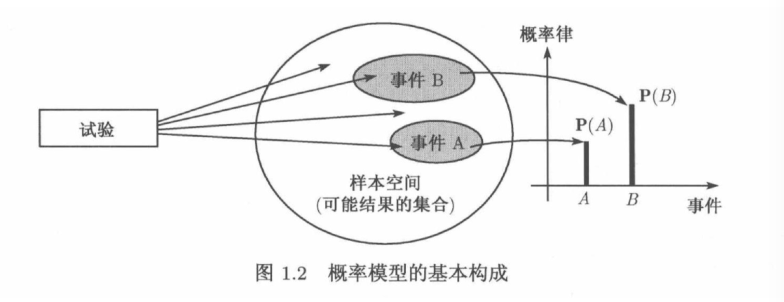

# 概率论与数理统计

概率论符号表

符号|含义|备注
-|-|-
E|试验|试验含义广泛，可以是科学实验，可以是对某个事物的某个特征的观察
S|样本空间|一个集合，样本点的集合，试验E的所有可能的结果组成的集合，如试验掷骰子的样本空间为{1,2,3,4,5,6}
A|事件|一个集合，试验结果的集合，样本点的集合，样本空间的子集，试验的某些结果组成的集合，如试验掷骰子掷得奇数这个事件{1,3,5}。这个子集中的一个样本点出现，称事件A发生
$A\subset B$|事件B包含A
A = B|事件A等于事件B
$A \cup B$|和事件|事件A与事件B的和事件，当A或B有一个事件发生时，事件 $A\cup B$ 发生
$A\cap B$（AB）|积事件|事件A与事件B的积事件，A与B同时发生时，事件$A\cap B$发生
$\overline A$|互逆事件，对立事件|$A \cup B=S,A\cap B=\emptyset$，事件A与B必有一个发生，且仅有一个发生
P(A)|事件A的概率，函数，离散模型的事件的概率由包含的各个试验结果的概率确定
$P(A\cup B)$||事件A、B至少发生一个的概率
$P(A\cup B)=P(A)+P(B)$|概率的有限可加性|前提是，A与B是不相容的事件，即$A\cup B=\emptyset$
$P(A\cup B)=P(A)+P(B)-P(AB)$|概率的$\red{加法公式}$|没有前提，任意两个事件A、B
$P(A\cap B)或P(AB)$|联合概率|事件A、B同时发生的概率
$P(A\cap B)=P(AB)=P(A)P(B)$|A、B同时发生的概率|前提，事件A、B相互独立。事件A对事件B的发生没有影响，反之亦然
$P(A\cap B)=P(AB)=P(A)P(B\|A)$|概率的$\red{乘法公式}$|前提，事件A、B不是相互独立。事件A对事件B的发生有影响
P(B\|A)|条件概率|事件A已发生的条件下事件B发生的概率。事件A对事件B发生的概率有影响
X|随机变量|是函数，是自变量，是样本点的映射，是随机试验的试验结果，或者随机试验的样本空间中的样本点或样本点集合（事件）在实数范围内的映射。是对事件的量化
## 0.概率论发展
概率论有三种不同的解释：古典概率、频率概率、主观概率。
## 1.概率论基础概念
### 1.1.集合
#### （1）集合
将一些研究对象放在一起，形成集合。
- 概率论大量应用集合运算。

##### 记法
若 S 包含有限个元素 $x_1,x_2,...,x_n$，我们只需将这些元素包含在花括号中，$S = \{x_1,x_2,...,x_n\}$

我们也可以以 x 具有某种性质 P 为条件来刻画一个集合，记作 {x|x 满足性质 P}。如 $\{x|0\leq x \leq 1\}$

#### （2）集合元素
集合中的对象称为元素。
记号：x 是 S 的元素，我们将元素和集合的这种关系写成 $x\in S$，若 x 不是 S 的元素，就写成 $x\notin S$。

#### （3）空集
一个集合可以没有元素，这个特殊的集合称为空集，记作 $\emptyset$。

#### （4）子集
若集合 S 的所有元素均为集合 T 的元素，就称 S 为 T 的子集。记作 $S\subset T$

#### （5）空间
将我们感兴趣的所有元素放在一起，形成一个集合，这个集合称为空间。记作 $\Omega$

#### （6）集合运算
##### 补集
集合 $\{x\in \Omega|x\notin S\}$称为集合 S 相对于 $\Omega$ 的补集。
##### 并集
由属于 S 或属于 T 的元素组成的集合称为 S 和 T 的并，记为 $S\cup T$，$S\cup T = \{x|x\in S 或 x\in T\}$。
##### 交集
既属于 S 又属于 T 的元素组成的集合称为 S 和 T 的交，记为 $S\cap T$，$S\cap T$，$S\cup T = \{x|x\in S且x\in T\}$。
##### 无穷个集合并
$$\bigcup_{n=1}^{\infty}S_n = S_1\cup S_2\cdots =\{x|x\in S_n 对某个n成立\}$$

##### 无穷个集合交
$$\bigcap_{n=1}^{\infty}S_n = S_1\cap S_2\cdots = \{x|x\in S_n 对一切n成立\}$$

#### （7）韦恩图
集合及其运算可用韦恩图形象化表示。

#### （8）有序对
设 x 和 y 为两个研究对象，我们用 (x,y) 表示 x 和 y 的有序对。

#### （9）实数集合
我们用 R 表示实数集合，用 $R^2$ 表示实数对的集合，即二维平面。用 $R^3$ 表示三维实数向量的集合（三维空间）。

### 1.2.试验
#### （1）随机试验
试验作为一个含义广泛的术语，可以是科学试验，也可以是对某一个事物的某一特征的观察。用 E 表示试验，例如掷骰子试验 E。

将具有以下三个特点的试验称为随机试验
- 1.可以在相同的条件下重复地进行
- 2.每次试验的可能结果不止一个，并且能事先明确试验的所有可能结果
- 3.进行一次试验之前不能确定哪一个结果会出现。

#### （2）随机现象
在个别试验中其结果呈现出不确定性，在大量重复试验中其结果又具有统计规律性的现象，我们成为随机现象。概率论与数理统计是研究和揭示随机现象统计规律性的一门数学学科。

我们是通过研究随机试验来研究随机现象的 。

### 1.3.样本
#### （1）样本空间
试验的所有可能结果组成的集合是已知的，将随机试验 E 的所有可能结果组成的集合称为 E 的样本空间，记为 S。例如掷骰子的样本空间为：S = {1,2,3,4,5,6}

样本空间是样本点的集合。

#### （2）样本点
样本空间的元素，即 E 的每个结果，称为样本点。

### 1.4.事件
#### （3）随机事件
我们称试验 E 的样本空间 S 的子集为 E 的随机事件。记为A，如掷骰子掷得奇数的事件 A = {1，3，5}

事件是集合，样本点的集合。

#### （4）事件发生
当且仅当事件中的一个样本点出现时，称这一事件发生。

#### （5）基本事件
由一个样本点组成的单点集，称为基本事件。

#### （6）必然事件
#### （7）不可能事件
#### （8）事件间的关系与事件的运算
事件是一个集合，因而事件间的关系与事件的运算按照集合论中集合之间的关系和集合运算来处理。
- 子集
- 包含
- 相等
- 和事件：$A\cup B=\{x|x\in A或x\in B\}$称为事件 A 和 事件 B 的和事件，当A、B中有一个样本发生时，事件 $A\cup B$发生。
- n个事件的和事件：$$\bigcup_{k=1}^nA_k为n个事件A_1,A_2,...,A_n的和事件$$
- 可列个事件的和事件：
$$\bigcup_{k=1}^{\infty}A_k为可列个事件A_1,A_2,...的和事件$$
- 积事件：$A\cap B=\{x|x\in A且x\in B\}$称为事件 A 与 事件 B 的积事件，当且仅当A、B同时发生时，事件$A\cap B$发生，也记作 AB。
- 和事件：$A\cup B=\{x|x\in A或x\in B\}$称为事件 A 和 事件 B 的和事件，当A、B中有一个样本发生时，事件 $A\cup B$发生。
- n个事件的积事件：$$\bigcap_{k=1}^nA_k为n个事件A_1,A_2,...,A_n的和事件$$
- 可列个事件的积事件：
$$\bigcap_{k=1}^{\infty}A_k为可列个事件A_1,A_2,...的和事件$$

#### （9）差事件
事件$A-B=\{x|x\in A 且 x\notin B\}$称为事件 A 与事件 B 的差事件。当且仅当 A 发生、B不发生时事件 A-B 发生。

#### （10）互斥事件
若 $A\cap B=\emptyset$，则称事件 A 与 B 是互不相容的，或互斥的，即事件 A 与事件 B 不能同时发生。

#### （11）对立事件（互逆事件）
若 $A\cup B=S，且A\cap B=\emptyset$，则称事件 A 与事件 B 互为逆事件，又称事件 A 与事件 B 互为对立事件。对每次试验而言，事件A、B必有一个发生，且仅有一个发生。A的对立事件记为 $\overline A$，$\overline A=S-A$

#### （12）事件运算
事件运算，即集合运算
- 交换律
- 结合律
- 分配律
- 德摩根律

### 1.5.概率
#### （1）试验次数
重复试验次数 n
#### （2）频率
频率：表征事件在一次试验中发生的可能性的频繁程度。

定义：
在相同的条件下，进行了 n 次试验，在这 n 次试验中，事件 A 发生的次数 $n_A$ 称为事件 A 发生的频数，比值 $n_A/n$ 称为事件 A 发生的频率，并记成$f_n(A)$

#### （3）频率的性质
- $0\leq f_n(A)\leq 1$
- $f_n(S)=1$
- 若$A_1,A_2,...,A_k$是两两互不相容的事件，则 $f_n(A_1\cup A_2\cdots A_k)=f_n(A_1)+f_n(A_2)+\cdots +f_n(A_k)$

当重复试验的次数 n 逐渐增大时，频率 $f_n(A)$ 呈现出稳定性，逐渐稳定于某个常数，这种“频率稳定性”即通常所说的统计规律性。

但是，在实际中，我们不可能对每一个事件都做大量的试验，我们从频率的稳定性和频率的性质得到启发，给出表征事件发生可能性大小的概率的定义。

#### （4）概率
概率：表征事件在一次试验中发生的可能性的大小的数。

- 逆概率
- 互斥：A、B不可能同时发生
- 对立：A、B不可能同时发生，必有一个发生
- 独立：A、B发生互不影响
- 条件：A、B发生有影响

##### 定义：
设 E 是随机试验，S 是它的样本空间，对于 E 的每一个事件 A 赋予一个实数，记为P(A，称为事件的概率。
- 频率，概率都是函数。

##### 概率的性质
- 1.$P(\emptyset)=0$
- 2.有限可加性，若$A_1,A_2,...,A_n$ 是两两互不相容的事件，则 $P(A_1\cup A_2\cup \cdots \cup A_n)=P(A_1)+P(A_2)+\cdots+P(A_n)$
- 3.逆事件概率：$P(\overline A)=1-P(A)$
- 4.概率的加法公式：对于任意两事件A、B，有$P(A\cup B)=P(A)+P(B)-P(AB)$

#### （5）概率律（概率定律）
没有规律的过程却从大体上呈现有规律性。由四条概率定律组成：
- 概率第一定律： 
概率是0到1之间任何一个数字，数字越大，概率越高。当数字为1时，表明该事件绝对会发生。当数字为0时，表明该事件绝对不会发生。
- 概率第二定律： 
互斥事件：如果A和B是相互独立的事件（A、B互斥，即事件A、B不可能同时发生），那么P(A+B)=P(A)+P(B)
- 概率第三定律： 
对立事件：A、B对立，即事件A、B不可能同时发生，但A、B必然有一个发生，计算公式P(A)+P(B)=1，P(A)=1-P(B),$P(\overline A)=1-P(A)$
- 概率第四定律： 
互相独立事件：一个事件 A 是否发生对另一个事件 B 发生的概率没有影响。P(AB)=P(A)P(B)

##### 概率公理
- 非负性 
对于一切事件A，满足 P(A>=0
- 可加性 
设A、B为两个互不相容的集合（概率论中称为互不相容的是事件），则它们的并满足 $P(A\cup B)=P(A)+P(B)$，更一般地，$P(A_1\cup A_2\cup ...)=P(A_1)+P(A_2)+...$
- 归一化 
整个样本空间 $\Omega$ 的概率为1，即 $P(\Omega)=1$

为了将概率定律形象化，可以把样本空间中的试验结果看成质点，每一个质点有一个质量，P(A) 就是这个质点的质量，全空间的总质量为1。

#### （6）概率模型
概率模型是对不确定现象的数学描述。概率模型的两个构成：
- 样本空间：$\Omega$，这是一个试验的所有可能结果的集合。
- 概率定律：没有规律的过程却从大体上呈现有规律性。概率定律为试验结果的集合或者也叫事件A确定一个非负数P(A)（称为事件A的概率）。而这个非负数刻画了我们对事件Ade认识或所产生的信念的程度。

- 概率模型用来刻画样本空间中的试验结果。

#### （7）序贯模型
#### （8）离散概率模型
##### 离散概率定律
设样本空间由有限个可能的结果组成，则事件的概率可由组成这个事件的试验结果的概率所决定，事件 $\{s_1,s_2,...,s_n\}$ 的概率是 $P(s_i)$ 之和，即
$$P(\{s_1,s_2,...,s_n\})=P(s_1)+P(s_2)+...+P(s_n)$$
此处 用简单的记号 $P(s_i)$表示事件 $\{s_i\}$的概率，而不用正式的符号 $P(\{s_i\})$

#### （9）离散均匀概率定律（古典概型）
设样本空间由 n 个等可能性的试验结果组成，因此每个试验结果组成的事件的概率是相等的，$$P(A)=\frac{含于事件A的试验结果数}{n}$$

#### （10）连续模型
- 若试验的样本空间是一个连续集合，其相应的概率律于离散情况有很大的差别。
- 在离散情况下，基本事件的概率就可以确定概率律
- 将离散模型中的等概率模型推广到连续的情况

## 2.随机变量及其分布
### 2.1.随机变量
#### （1）为什么要引入随机变量
- 为了能对更复杂的问题进行抽象建模，进行定量的概率公式化处理，因此，通过引入随机变量，将样本空间这个集合概念转化为一个无量纲的数集，使得能统一地处理各种随机现象。（函数化）
- 引入随机变量的好处主要有两点：一是可用随机变量的不同取值代表不同的事件，比起用A、B、C、D等符号方便很多。二是可以进行综合分析，比如求和、均值等。
- 引入随机变量可以量化随机事件
- 随机变量的概念是概率论中一个极为重要的基本概念
- 随机变量及其分布函数是概率论中的核心概念，它们将”随机试验中关于随机现象及其统计规律性的研究“投射为”实数集中关于随机变量的概率分布的研究“，这样一来我们就可以通过研究随机变量来研究随机现象
- 随机变量就是一个函数，自变量是样本点，定义域是样本空间。值域是实数
- 随机取值的因变量X 为随机变量。大量试验中样本点呈现出的统计规律性决定了 X 在其值域中的取值也具有统计规律性，称之为 X 的概率分布。
- 当样本空间 S 的元素不是一个数时，人们对于 S 就难以描述和研究。现在来讨论如何引入一个法则，将随机试验的每一个结果，即将 S 的每一个元素 $e$ 与实数 $x$ 对应起来，从而引入了随机变量的概念。

#### （2）随机变量定义
设随机试验的样本空间为 $S=\{e\}$，$X = X(e)$ 是定义在样本空间 S 上的实值单值函数，称 $X=X(e)$为随机变量。

- 在许多概率模型中试验结果是数值化的，例如许多仪器的仪表盘的读数以及股价等。也有其他一些例子中的试验结果不是数值化的，但是这些试验结果与某些数值相联系，例如，从某个群体中选择学生，我们希望了解每位学生的平均学分，当我们讨论这些数字的时候，通常给这些数字确定概率。我们可以通过随机变量实现这个任务。
- 假设在某个试验中，所有可能的试验结果构成一个样本空间。对于样本空间中的每一个可能的试验结果，关联着一个特定的数，这种**试验结果与数的对应关系形成一个随机变量**。将试验结果所对应的数称为随机变量的取值。
- 随机变量是一个函数，随机变量是试验结果的一个实值函数。
- 随机变量是因变量，是样本点的映射，样本空间中样本点在实数上的映射。

#### （3）随机变量例子
例1：将一枚硬币抛掷三次，观察出现正面和反面的情况，样本空间是 S={HHH,HHT,HTH,THH,HTT,THT,TTH,TTT}。以 X 记三次投掷得到正面H的总数，那么，对于样本空间 S={e} 中的每一个样本点 e，X 都有一个数与之对应。X 是定义在样本空间 S 上的一个实值单值函数。它的定义域是样本空间 S，值域是实数集合{0,1,2,3}。使用函数记号可将 X 写成
$$ X=X(e)=
\left\{\begin{array}{lll}
3,&e=HHH,\\ 
2,&e=HHT,HTH,THH,\\ 
1,&e=HTT,THT,TTH,\\ 
0,&e=TTT.
\end{array}\right.
$$

#### （4）随机变量：样本点与实数的映射
如图是样本点 e 与实数 X=X(e) 对应的示意图。

有许多随机试验，它们的结果本身是一个数，即样本点 e 本身是一个数。我们令 X=X(e)=e，那么 X 就是一个随机变量。例如，用 Y 记某车间一天的缺勤人数，以 W 记某地区第一季度的降雨量，以 Z 记某工厂一天的耗电量，以 N 记某医院某一天的挂号人数。那么 Y,W,Z,N 都是随机变量。

一般以大写字母如X,Y,Z,W...表示随机变量，而以小写字母x,y,z,w...表示实数。

#### （5）随机变量的取值
随机变量的取值随试验的结果而定，而试验的各个结果出现有一定的概率，因而随机变量的取值有一定的概率。

###### 随机变量的取值
在上面例子中 X 取值为2（投掷3次硬币正面朝上的次数为2的事件），记成 {X=2}。

###### 事件（样本点的集合）
{X=2} 对应于样本点的集合 A={HHT,HTH,THH}，这是一个事件，当且仅当事件A发生时有 {X=2}

###### 随机变量的取值与事件等价
将事件A={HHT,HTH,THH}说成是事件{X=2}

###### 事件发生的概率（随机变量取值的概率）
称概率 P(A)=P{HHT,HTH,THH}为{X=2}的概率，即P{X=2}=P(A)

###### 综上
一般，若 L 是一个实数集合，将 X 在 L 上取值写成 $\{X\in L\}$。它表示事件 $B=\{e|X(e)\in L\}$，即 B 是由 S 中使得 $X(e)\in L$的所有样本点 e 所组成的事件，此时有$$P\{X\in L\}=P(B)=P\{e|X(e)\in L\}$$

随机变量的取值随试验的结果而定，在试验之前不能预知它取什么值，且它的取值有一定的概率。这些性质显示了随机变量与普通函数有着本质的差异。

随机变量的引入，使我们能用随机变量来描述各种随机现象，并能利用数学分析的方法对随机试验的结果进行深入广泛的研究和讨论。

### 2.2.离散型随机变量及其分布律
#### （1）离散型随机变量
- 有些随机变量，它全部可能取到的值是「有限个」或「可列无限多个」，这种随机变量称为离散型随机变量。
- 例子：某城市的120急救电话台一昼夜收到的呼叫次数是离散型随机变量。以 T 记某元件的寿命，它所可能取的值充满一个区间，是无法按一定次序一一列举出来的，因而它是一个非离散型的随机变量。

#### （2）离散型随机变量的分布律
要掌握一个离散型随机变量 X 的统计规律，必须且只需知道 X 的所有可能取值以及每一个可能值的概率。

#### （3）分布律的定义
设离散型随机变量 X 所有可能取的值为 $x_k(k=1,2,...)$，X 取各个可能值的概率，即事件 $\{X=x_k\}$的概率为$$P{X=x_k}=p_k,k=1,2,...$$。以上式子称为离散型随机变量 X 的分布律。

#### （4）分布律的表示形式
X|$x_1$|$x_2$|...|$x_n$|...
-|-|-|-|-|-
$p_k$|$p_1$|$p_2$|...|$p_n$|...

分布律也可以用表格的形式来表示，表格形式直观地表示了随机变量 X 取各个值的概率的规律。X取各个值各占一些概率，这些概率合起来是1。可以想象：概率1以一定的规律分布在各个可能值上。这也是称为分布律的缘故。

#### （5）分布律例子
例1：设一汽车在开往目的地的道路上需经过四组信号灯，每组信号灯以 1/2 的概率允许或禁止汽车通过，以 X 表示汽车首次停下时，它已通过的信号灯的组数（设各组信号灯的工作是相互独立的），求 X 的分布律。
解：以 p 表示每组信号灯禁止汽车通过的概率，易知 X 的分布律为
X|0|1|2|3|4
-|-|-|-|-|-
$p_k$|p|(1-p)p|$(1-p)^2p$|$(1-p)^3p$|$(1-p)^4p$
或写成 $P\{X=k\}=(1-p)^kp,k=0,1,2,3,4$

#### （6）三种重要的离散型随机变量
- (0-1)分布
- 伯努利试验、二项分布
- 泊松分布

### 2.3.随机变量的分布函数

事件的样本点--随机变量的取值及取值的概率--分布函数

符号|描述
-|-
X|大写字母 X 表示随机变量，X=X(e)，X是一个函数，将随机试验每个结果（每个元素）e映射到实数
x|小写字母 x 表示实数
{X=x}|随机变量X的取值，即事件的发生（随机变量的取值与事件的关系）
P{X=x}|随机变量取值的概率，事件发生的概率
P{X<=x}|随机变量取值的概率
F(x)|分布函数，F(x)=P{X<=x}

#### （1）随机变量的取值（单值）的概率
对于离散型随机变量 X ，我们研究 X 取某个值的概率，可以用分布律来描述。

#### （2）随机变量的取值（区间）的概率
对于非离散型随机变量 X，其可能的取值不能一一列举出来，另外非离散型随机变量取任一指定的实数值的概率都等于0，研究单值的概率意义不大。

#### （3）分布函数描述
我们研究随机变量所取的值落在一个区间$[x_1,x_2]$的概率：$P\{x_1<X\leq x_2\}$。但由于$P\{x_1<X\leq x_2\}=P\{X\leq x_2\}-P\{X\leq x_1\}$，所以我们只需知道$P\{X\leq x_2\}$和$P\{X\leq x_1\}$就可以了。

#### （4）分布函数定义
设 X 是一个随机变量，x是任意实数，函数$$F(x)=P\{X\leq x\},-\infty <x<\infty$$称为 X 的分布函数。

对于任意实数$x_1,x_2(x_1<x_2)$，有$$P\{x_1<X\leq x_2\}=P\{X\leq x_2\}-P\{X\leq x_1\}=F(x_2)-F(x_1)$$。

#### （5）分布函数意义
若已知 X 的分布函数，我们就知道 X 落在任一区间$(x_1,x_2)]$上的概率，从这个意义上说，分布函数完整的描述了随机变量的统计规律性。

分布函数是一个普通的函数，正是通过它，我们将能用数学分析的方法来研究随机变量。

如果将 X 看成是数轴上的随机点的坐标，那么，分布函数 F(x) 在 x 处的函数值就表示 X 落在区间$(-\infty,x]$上的概率。

虽然对于离散型随机变量，我们可以用分布律全面的描述它，但为了从数学上能统一地对随机变量进行研究，在这里，我们对离散型随机变量和非离散型随机变量统一地定义了分布函数。

#### （6）分布函数性质与特点
分布函数 F(x) 具有以下的基本性质：
- 1.F(x) 是一个不减函数。对于任意实数$x_1,x_2（x_1<x_2）$，有$F(x_2)-F(x_1)=P\{x_1<X\leq x_2\}\geq 0$
- 2.$0\leq F(x)\leq 1$，且$F(-\infty)=\lim_{x\to -\infty}F(x)=0$，$F(\infty)=\lim_{x\to \infty}F(x)=1$
    - 从几何上加以说明，将 x 沿数轴无限向左移动（即$x\to -\infty$），则“随机点 X 落在点 x 左边”（X是随机变量，是样本点映射的实值）这一事件趋于不可能事件，从而其概率趋于0，即有$F(-\infty)=0$；又若将点 x 无限右移（即$x\to \infty$），则“随机点 X 落在点 x 左边”这一事件趋于必然事件，从而其概率趋于1，则有 $F(\infty)=1$
- 3.F(x+0)=F(x)，即F(x)是右连续的。

分布函数 F(x) 特点：
- F(x)的值是 $X\leq x$的累计概率值（大写X是随机变量，小写x是实数）
- 离散
- 连续

#### （7）离散型随机变量的分布函数
一般，设离散型随机变量 X 的分布律为 $P{X=x_k}=p_k,k=1,2,...$。由概率的可列可加性得 X 的分布函数为
$$F(x)=P\{X\leq x\}=\sum_{x_k\leq x}P{X=x_k}，即F(x)=\sum{x_k\leq x}p_k$$，
这里和式是对于所有满足 $x_k\leq x$的 k 求和的。分布函数 F(x) 在 $x=x_k(k=1,2,...)$处有跳跃，跳跃值为 $p_k=P\{X=x_k\}$。

$$F(x)=P\{X\leq x\}=\sum_{x_k\leq x}P\{X=x_k\}=P\{X=1\}+P\{X=2\}+...+P\{X=x\}=\sum_{x_k\leq x}p_k$$

###### 例子
例1：设随机变量 X 的分布律为：

X|-1|2|3
-|-|-|-
$p_k$|1/4|1/2|1/4

求 X 的分布函数，并求 $P\{X\leq \frac{1}{2}\}$,$P\{\frac{3}{2}<X\leq \frac{5}{2}\}$,$P\{2\leq X\leq 3\}$

解：X 仅在 x=-1,2,3 三点处其概率≠0，而 F(x) 的值是 $X\leq x$的累积概率值，由概率的有限可加性，知它即为小于或等于

#### （8）连续型随机变量的分布函数

### 2.4.连续型随机变量及其概率密度

### 2.5.随机变量的函数的分布

## 3.多维随机变量及其分布

## 4.随机变量的数字特征

## 5.大数定理及中心极限定理

## 6.样本及抽样分布

## 7.参数估计

## 8.假设检验

## 9.xxd1