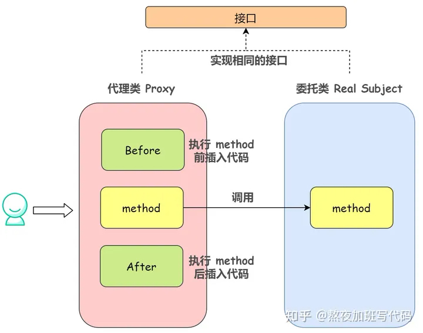

# 四、设计模式
## （一）代理模式
- 代理模式的作用：为其他对象提供一种代理以控制对这个对象的访问。也就是在某些情况下客户不想或不能直接引入一个对象，而代理对象可以在客户和目标对象之间起到中介作用，去掉客户不能看到的内容和服务或增添客户需要的额外服务。

### 1.基本概念
#### （1）代理
代理，意即一个角色代表另一个角色来完成某些特定的功能或任务。

代理具有以下优点：
- 一是委托方可以将自己有限的资源投入到自己的核心业务上，加快新产品的研发进度，从而更好地满足消费者的需求，而一些附属业务则可以交给代理方来完成。
- 二是省去了亲自开拓市场的麻烦，让当地的代理人去开拓当地市场，充分利用了代理人在当地的各种资源，既提升了自己产品的知名度，又扩大了市场占有率
- 三是可以极大地激发代理商的热情，在销售产品的同时创造性地给顾客提供一些额外的服务，提高商品的附加值，增加代理商的利润。

#### （2）代理模式
代理模式属于设计模式中结构化模式的一种，为其他对象提供一个代理对象，并使用代理对象来控制对原对象的访问。就是在一些情况下已有对象提供的服务不能直接应用于当前的问题环境中，或者不想让访问者直接访问现有对象，这是可以为该对象建立一个代理对象，这样客户程序就可以通过代理对象来访问对象，代理对象就成了客户程序和目标对象之间的中介。在代理对象中可以对真实对象已有的服务进行适当性修改，还可以在原对象的业务方法执行前后增加特定的服务性代码，使得服务更加人性化。

#### （3）三个角色
代理模式中的代理对象要为真实对象提供代理，就必须和被代理的对象使用相同的业务规范模式。在java中，这个相同的业务规范模式可以用Java中的接口来实现。代理模式一般涉及到三个角色
- 抽象角色
- 代理角色
- 真实角色

#### （4）抽象角色
声明真实对象和代理对象的共同接口。定义了真实角色和代理角色共同遵守的业务规范，即接口。
##### 特点
- 真实角色作为代理对象的内部属性

#### （5）代理角色
代理角色内部含有对真实对象的引用，从而可以操作真实对象，同时代理对象实现与真实对象相同的接口以便在任何时刻都能代替真实对象。代理对象可以在执行真实对象操作时，附加其他的操作，相当于对真实对象进行封装。
- 为真实角色提供代理服务的对象，和真实角色都实现了抽象角色中定义的接口。
- 代理角色包含了真实角色的引用。

#### （6）真实角色
代理角色所代表的真实对象，是我们最终要引用的对象。定义了需要通过代理访问的真实对象。
#### （7）场景类/客户端

#### （8）代理的类型
代理模式可以分为静态代理和动态代理。

#### （9）静态代理
静态代理指需要代理的真实角色和代理角色都是事先定义好的，并且真实角色与代理角色之间是一对一的关系。

缺点：
- 真实角色与代理角色之间是一对一的关系，如果一个程序中有很多真实角色需要代理，就会导致类绝对数量的增加。
- 真实角色和代理角色之间的代理关系是固定的，不能在程序运行过程中动态改变和调整。

#### （10）动态代理
在动态代理中，代理角色是在程序运行时利用Java机制动态创建的。可以在运行时动态改变被代理的角色，改变代理的接口以及控制代理的方式，实现了一种非常灵活的代理关系。
- 动态代理通常是在程序运行时，通过反射机制动态生成的。
- 动态代理类通常代理接口下的所有类，实现不知道要代理哪个类，只有在运行时才能确定。
- 动态代理的调用处理程序必须事先事先InvocationHandler接口，使用Proxy类中的newProxyInstance方法动态的创建代理类。

### 2.静态代理

### 3.动态代理

#### （1）✔︎ 接口 Subject
#### （2）✔︎ 委托类 Real Subject

#### （3）✔︎ InvocationHandler接口
代理类=委托类+增加方法，代理类中调用委托类方法。为了做一个通用的代理类（代理不同的委托类），我们把调用委托类方法这个动作抽取出来，把它封装成一个通用性的处理类，于是就有了动态代理中的InvocationHandler角色（处理类）。

在代理类和委托类之间多了一个处理类的角色，这个角色主要是对代理类调用委托类方法的这个动作进行统一的调用，也就是由InvocationHandler来统一处理代理类调用委托类方法这个操作。

#### （4）invoke()方法
`invoke()`方法在接口中声明，创建一个处理类实现`InvocationHandler`接口，重写其 `invoke()` 方法。在`invoke()`方法中利用反射机制调用委托类方法，并自定义一些处理逻辑。

##### 定义
```java
public interface InvocationHandler {
    public Object invoke(Object proxy, Method method, Object[] args) 
        throws Throwable;
}
```
##### invoke方法功能
##### invoke方法参数
- proxy：代理类对象
- method：Method.invoke，通过这个反射调用委托类方法
- args：传给委托类方法的参数列表

#### （5）反射机制
java提供了一套机制来动态执行方法、构造方法以及数据操作等，这套机制叫反射。反射机制是如今很多java流行框架的实现基础，其中包括Spring和Hibernate等。如果将反射机制加入到java的代理模式中，就可以**实现一个公共的代理类**，省去不少功夫。

#### （6）处理类
创建自己的处理类，实现`InvocationHandler`接口，重写`invoke`方法。并将委托类注入处理类。

#### （7）✔︎ 代理类
#### （8）代理类实例工厂
通过`Proxy.newProxyInstance()`创建代理对象。
```java
public static Object newProxyInstance(ClassLoader loader,
                                      Class<?>[] interfaces,
                                      InvocationHandler h)
    throws IllegalArgumentException

```
##### `newProxyInstance`方法参数
- 类加载器
- 委托类实现的接口数组，至少需要传入一个接口
- 处理类，以上创建的实现InvocationHandler接口的处理类，用来处理接口方法，即代理类调用委托类方法
- 静态代理中代理类需要传入被代理对象，而使用newProxyInstance方法生成代理类实例时传入的实际对象时InvocationHandler实现类的实例，看起来好像生成了InvocationHandler的代理对象

#### （9）动态性
动态代理是在运行时生成`.class`字节码文件，并加载到JVM中（而不是在编译器生成的.class字节码）。


#### （3）（动态）代理类
动态代理类（公共代理类）是一个实现在创建类时在运行时指定的接口列表的类。
- 每一个动态代理类都必须要实现InvocationHandler接口。
- 事先InvocationHandler的接口方法invoke。

#### （4）（动态）代理实例
代理实例是代理类的一个实例。
- 每个动态代理实例都关联到了一个Handler，当我们通过代理对象调用一个方法的时候，这个方法的调用会被转发为有InvocationHandler接口的invoke()方法来进行调用。

#### （5）Proxy类
- Proxy这个类的作用就是用来动态创建一个代理对象的类。
- Proxy类使得设计师能够在运行期间创建代理。通过调用`Proxy.getProxyClass()`方法时传入的类加载器和一个接口数组，就可以得到一个对应代理类的Class对象。代理对象有一个构造函数，它需要一个`InvocationHandler`对象做参数，这个构造函数对应的Constructor对象可以由上面的Class对象得到，在该Class对象上引发newInstance方法可以得到一个代理对象。
- Proxy类包含一个创建动态代理所用的静态方法：`newProxyInstance()` 。这是一种快捷方式，该方法需要一个类加载器、一个接口数组和一个调用处理程序三个参数。

##### Proxy类提供的方法
###### `getProxyClass()`方法
功能：创建动态代理类的字节码。
###### `newProxyInstance()`方法
功能：创建动态代理类的实例。
###### `Invoke()`方法
功能：

`public static Object newProxyInstance(ClassLoader loader,Class<?>[] )`
这个方法的作用就是得到一个动态的代理对象。


### 4.代理使用场景