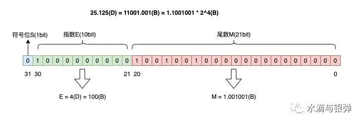
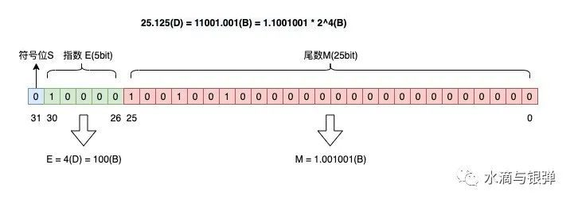
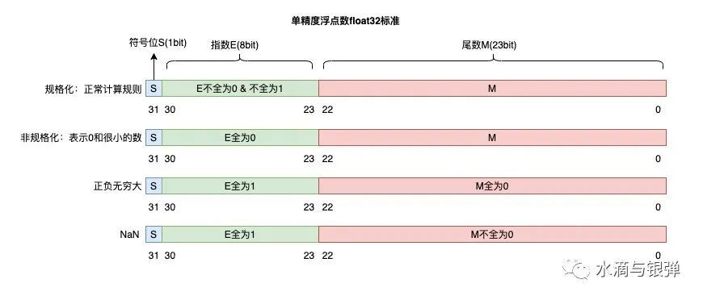

# 一、计算机系统
## （一）计算机组成原理
计算机组成原理主要介绍计算机系统的基本组成，包括基本的硬件系统和软件系统。通过学习CPU、主存储器、I/O接口、系统总线等各个组成部分的基本概念、结构及工作原理和功能实现方法，建立计算机的整机概念，了解其工作原理。

现代计算机自发明以来其结构的基本组成和工作原理一直遵循冯诺依曼机型原理，基本部件有：运算器、控制器、存储器、输入设备、输出设备五部分。
- 运算器：用于进行算术和逻辑运算，也可暂存运算的中间结果
- 控制器：用于控制计算指令和数据的输入、运算和结果处理
- 存储器：用于存放指令和数据
- 输入设备：负责将计算的原始数据输入并转换为机器语言
- 输出设备：负责将计算结果呈现出来

在执行计算操作时，按照存储程序原理，由输入设备输入程序和数据（一系列事先设计好的运算指令和数据以二进制的形式存放在存储器内），将其送入内存后，计算机按一定的方法寻址访问，按照指令中包含操作码和地址码，用指定的操作的方法对数据对象按照规定的规则顺序进行，计算结果由输出设备输出、显示。

计算机组成原理包括运算方法和运算器、多层次的存储体系、指令系统、中央处理器、总线系统、外设与I/O设备、输入输出系统和并行组织和结构。

计算机组成原理的核心思想是“程序存储和程序控制”。

### 1.基本概念
#### （0）计算思维
计算思维是将现实问题转为计算机可解决的问题的思维过程。包括以下几个环节：
- 问题转换方法。指求解实际问题时，利用抽象、数据分析、数据建模、自动化等手段，对问题进行深刻的认识和理解，然后形式化，进行问题转换。
- 计算装置。即计算机系统，熟悉计算装置的工作原理有助于理解计算思维的内涵。
- 处理方法。由于计算机系统不同于其他类型的机器，它所特有的程序存储和程序自动执行功能决定它特有的处理方法。处理方法的核心就是算法，算法对处理的信息进行定义，产生不同的简单操作，再由简单操作构成复杂操作，形成系统的求解问题的方法。

一方面，需要将知识体系分解为知识单元和知识点，以名词概念进行解释。另外，结合层次化、模块化的设计理念和自顶向下系统性理解知识。理解计算机串并结合的思想，计算机系统中有的部件是不相容的，串行的，主动触发部件优先于被触发的部件，有的部件之间是相容的，并行的。学习计算机怎样求解问题，单不要求人类像计算机那样的思考方式，否则容易本末倒置。

##### 层次化、模块化
- by体系结构，可计算模型-->图灵机-->冯诺依曼计算机-->基于总线的微型计算机机构-->多处理器计算机结构
- by组成。中央处理器-->存储器-->输入输出-->总线
- by程序存储和程序控制。数据表示-->运算方法-->指令系统

##### 串并结合思维
若从冯诺依曼计算机结构的本质讲，计算机系统是串行顺序的工作机制，必须逐一执行指令（取指令、分析指令、执行指令）。但为提高计算速度，计算机设计专家提出不少并行技术，如CPU的并行处理技术、存储器的双端口技术。从系统角度看，计算机硬件系统是一个串并结合的复杂系统。并行处理方式的三种特征：
- 时间重叠
- 资源重复
- 资源共享

#### （1）分层体系
- √ 微体系结构层
- √ 指令系统层
- 操作系统层
- √ 汇编语言层
- 面向问题的语言层

#### （2）功能部件组成体系
- CPU
- 存储系统
- I/O系统及其互连

#### （3）计算机
通常所讲的计算机，其全称是电子式数字计算机，它是一种能【存储程序】，能自动连续地对各种【数字化信息】进行【算术、逻辑运算】的快速工具。
- 电子式：指计算机的主要部件由电子电路构成
- 数字计算机：指信息采用数字化表示

##### 运算
首先，计算机是能够运算的设备。运算分为算术运算和逻辑运算。
- 算术运算。算术运算的对象时数值型数据，以四则运算为基础，许多复杂的数学问题可通过相应的算法最终分解为若干四则运算。
- 逻辑运算。逻辑运算用来解决逻辑型问题，如信息检索、判断分析和决策等。

所以我们将计算机的工作泛称为对信息进行运算处理。

##### 数字化信息
计算机中的信息用什么形式来表示呢？简单地讲，是用数字代码来表示各类信息，所以称为数字计算机。

##### 存储程序
计算机是怎样对这些数字化信息进行运算处理呢？它采用的是一种存储程序工作方式，即先编写程序，再由计算机将这些程序存储起来，然后通过连续、快速地执行程序实现各种运算处理。

##### 存储器
为了存储程序和数据，需要存储器

##### 运算器
为了进行运算处理，需要运算器

##### I/O设备
为了输入程序和数据，以及输出运算结果，需要有输入设备和输出设备

##### 控制器
控制器则对计算机的工作进行控制管理

#### （5）存储程序工作方式
计算机的工作最终体现为执行程序。
- 事先编制程序
将求解问题的处理过程用程序来实现，也就是编写程序。程序中包括指令，和需要运算处理的数据或者规定计算机在什么时候从输入设备获取数据。
- 事先存储程序
编写好的程序经由输入设备送入计算机，存放在存储器中。
- 自动、连续地执行程序
由于程序已经事先存储在存储器中，启动计算机并运行程序后，计算机就可以依照一定顺序从存储器中逐条读取指令，按照指令的要求执行操作，直到运行的程序执行完毕。

###### 指令
要求计算机硬件在一步中执行的操作命令称为一条指令，如加法指令。计算机最终执行的程序，其形态就是指令序列，即若干指令的有序集合，每一步将执行一条指令。

###### 控制流
程序执行时按照指令的序列依次读取指令，根据指令所含的空值信息调用数据，进行运算处理。在这一过程中，逐步发出的控制信息称为一种控制信息流，简称控制流，它是驱动计算机工作的因素。

###### 数据流
程序执行时依次处理的数据信息成为一种数据信息流，简称数据流，它是被调用的对象。

#### （6）信息数字化
信息分为两大类：控制信息（指令代码序列）和数据信息。

数据分为两大类：数值型数据和非数值型数据。

- a.在计算机中各种信息用数字代码表示 
例如数字、文字、图像、机器指令、设备状态。

- b.数字代码用数字型电信号来表示 
从物理实现层次看，数字代码需要用电信号去体现，这样才能用电子电路部件实现信息的传送和运算处理。电信号分为：模拟信号和数字信号。模拟信号是用信号的某些参量去模拟信号，如用电信号的幅值模拟数值大小。数字信号是一般只取两种状态的信号。许多物理量如压力和温度，需要先通过传感器变为模拟信号，再转换为数字信号，才可以用计算机处理。

#### （7）计算机系统的软、硬件
。

##### 计算机硬件系统
计算机硬件是指系统中可触摸到的设备实体，如运算器、控制器、存储器、输入设备、输出设备，以及将它们组织为一个计算机系统的总线、接口。

当前运算器和控制器集成在超大规模集成电路上，即芯片上，叫做CPU。负责执行程序，实现运算处理，控制整个系统的部件。

存储器分为高速缓存、主存储器（内存）、外存储器三个层次。

高速缓存集成在CPU内部，作为CPU的一个部分。所以运算器、控制器、高速缓存组成CPU。

CPU与主存储器（内存）合在一起称为主机。

外存储器包括主机之外的磁盘、光盘、磁带。

输入设备的任务是将外部信息输入主机，输出设备则是将主机的运算处理结果或其它信息从主机输出。

##### 计算机软件系统
计算机软件是指系统中的各类程序和文件，由于它们在计算机中体现为一些不能直接触摸到的二进制信息，所以称为软件。

### 2.计算机发展
#### （1）第一代计算机
第一代计算机从第一台计算机`ENIAC`问世到20世纪50年代末。这一时期计算机的主要特征是使用`电子管`作为电子器件，软件还处于初始阶段，使用`机器语言`与符号语言编制程序。主要用于科学计算。

第一代计算机体积大，运算速度低，存储容量不大，程序复杂。

#### （2）第二代计算机
第二代计算机从20世纪50年代末到60年代初。这一时期的计算机的主要特征是使用晶体管作为电子器件，在软件方面开始使用计算机高级语言。不仅用于科学计算，还用于数据处理和事务处理，逐渐用于工业控制。

这一代计算机体积大大减小，质量小、寿命长、耗电少、运算速度快、存储容量比较大。

#### （3）第三代计算机
第三代计算机从20世纪60年代中期到70年代初期。这一时期的计算机的主要特征是使用中小规模集成电路作为电子器件。在这一时期，操作系统的出现使计算机的功能越来越强，应用范围越来越广。不仅用于科学计算，还用于文字处理、企业管理和自动控制等领域，出现了计算机技术与通信技术相结合的管理信息系统，可用于生产管理、交通管理和情报检索等领域。

使用中小规模集成电路制成的计算机，体积与功耗进一步减小，可靠性和运算速度等指标也得到了进一步提高，并且为计算机的小型化、微型化提供了良好的条件。

#### （4）第四代计算机
第四代计算机从1971年到1990年，微型计算机得到了飞速发展。

是指用大规模与超大规模集成电路作为电子器件制成的计算机。这一代计算机各种性能都有了大幅度的提高，应用软件也越来越丰富，应用涉及国民经济的各个领域，已经在办公自动化、数据库管理、图像识别、语音识别和专家系统等众多领域大显身手。

#### （5）第五代计算机
第五代计算机从1990年开始到现在，指用甚大规模集成电路作为电子器件制成的计算机。主要有两个标志，一个是单片集成电路规模达100万晶体管以上，另一个是超标量技术的成熟和广泛应用。

### 3.计算机系统
计算机系统的组成可以分为硬件和软件两大范畴。

#### ➤➤➤ 冯诺依曼机 ➤➤➤
#### （1）冯诺依曼机思想
尽管计算机已经发展了五代，有各种规模和类型，但是当前的计算机仍然遵循冯诺依曼早期提出的基本原理运行。冯诺依曼原理的基本思想奠定了现代计算机的基本架构，并开创了程序设计的时代。

现代计算机都是冯诺依曼结构的计算机，它的基本原理是”存储程序和程序控制“，也就是说，计算机的工作是在程序的控制下运行，而程序又是预先存储在计算机内的。更详细的说就是要利用计算机完成一项处理任务时，首先要把任务转换成程序，然后将程序存储在计算机（内）存储器中，并命令计算机从程序的开始位置（某一条指令）开始工作，计算机的工作路线必须按照程序设计的路线进行，自动地执行并完成任务，直到结束的那条指令执行完为止。

冯诺依曼原理的基本思想是：
- 采用二进制代码表示数据和指令，即信息（数据和指令）的数字化。指令由操作码和地址码组成。
- 采用存储程序工作方式，即事先编制程序，事先存储程序，自动、连续地执行程序。
- 由存储器、运算器、控制器、输入设备、输出设备等5大部件组成计算机硬件系统。
- 原始的冯诺依曼机在结构上以运算器为中心，但演变到现在，电子数字计算机已经转向以存储器为中心。

#### （2）冯诺依曼机原理图

学好计算机的工作原理，即冯诺依曼机的工作原理，对于从根本上理解计算机的组织结构模型和运算过程至关重要。

掌握冯诺依曼机工作原理，不仅仅是了解计算机的5个组成部分加上简单的连接构成的一个原理图，虽然该图非常经典，但是不够形象，仅仅简单掌握了计算机的工作流程，对计算机工作原理掌握较肤浅。专业的学生往往都是在学习了微机原理及汇编语言才能更深刻的掌握计算机的工作原理。非专业的学生可以退而求其次通过冯诺依曼模型机掌握计算机工作原理。

#### （3）冯诺依曼模型机
- 计算机各个组成部分
- 存储程序工作原理

#### （4）信息
计算机的基本功能是对信息进行处理，计算机的整个工作过程可以归结为信息在计算机内的流动。其功能可以归纳为以下几点：
- ① 信息如何表示，以何种形式表示信息（穿孔、磁记录、电信号），数据信息采用何种格式（数制、编码、指令格式或语言等）
- ② 信息如何存储
- ③ 信息的变换，输入设备如何将程序信息变换为计算机能识别的信息形式；输出设备如何将计算机内的结果变换为操作员所能识别的形式
- ④ 信息的传送，外围设备与主机之间、主机内部CPU与存储器之间以及CPU内各寄存器之间信息是如何传送的
- ⑤ 信息的加工处理，一台计算机有哪些运算部件，能完成哪些基本的算术和逻辑运算，是如何完成这些运算的，又如何以这些基本的处理能力为基础，在软件的支持下完成更复杂的加工处理任务
- ⑥ 对上述过程的控制，计算机以什么形式表示它的各种控制命令信息，如何有序的发出这些控制命令以协调各部分的工作。

#### ➤➤➤ 计算机硬件系统 ➤➤➤
#### （1）存储器
#### （2）运算器
#### （3）控制器
#### （4）输入设备
#### （5）输出设备

#### ➤➤➤ 计算机软件系统 ➤➤➤

### 4.信息
#### ➤➤➤ 计算机中信息表示 ➤➤➤
计算机内部所处理的信息必须是数字化信息。因此计算机采用数字化方式来表示各种信息，其内部信息分为两大类：数据和指令。
- 数据信息 
数据信息是计算机所处理的对象，可分为数值型数据和非数值型数据。
	- 数值型数据
	- 非数值型数据：非数值型数据没有确定的值，

- 指令信息 
机器指令信息是计算机产生各种控制命令的基本依据。机器指令规定计算机完成某种操作。计算机处理任何问题，最终都是通过逐条执行机器指令来实现的。一台计算机所有机器指令的集合称为该计算机的指令系统。

#### （1）数制
数制也叫计数制，是用一定符号在统一规则下表示数值的方法，通俗地说就是逢几进位。常使用的数制有二进制、八进制、十进制和十六进制。
- 二进制 
二进制数用2个数字作基础，其中每一个二进制数字不是0就是1。
- 八进制 
一种以8为基数的计数法，采用0、1、2、3、4、5、6、7八个数字，逢8进1。
- 十进制
- 十六进制

#### （2）数位
数的位置。

#### （3）数码
在数制中表示数值大小的不同符号称为数码。例如，八进制有8个数码，即0~7；十进制有10个数码，即0~9。

#### （4）基数
在数制中数码的个数称为基数。例如，八进制的基数为8；十进制的基数为10。将基数记为R。

#### （5）位权
在数制中其中某位上的1所代表的数制大小称为位权。例如，八进制的123,1的位权为64,2的位权为8,3的位权为1；十进制的123,1的位权为100,2的位权为10,3的位权为1。将位权记为 $R^i$。如，10进制的位权表示为（从右到左）$10^0,10^1,10^2,...10^n$

多项式表示数的序列：
$$(N)_R=X_nR_n+X_{n-1}R^{n-1}+...+X_0R^0+X_{-1}R^{-1}+X_{-2}R^{-2}+...+X_{-m}R^{-m}=\sum_{i=-m}^nX_iR^i$$
其中：
- X表示所在数位上的数码
- R表示基数（数码的个数）
- n表示所在数位（通常说的整数第一位是n=0所在的位）

#### （6）二进制
二进制中，它的每个数位能选择的数码只有0或1，数码逢2进位或者借1当2，其基数为2。

##### 用序列表示二进制数
如采用序列的形式表示可将二进制的数表示为：$(X_nX_{n-1}...X_0X_{-1}...X_{-m})_2$
- X为各个数位上的数码
- n表示所在的数位
- 右下角角标表示括号中序列的基数，也就是它是几进制的数
- 位权不需表达出来，因为已经约定在式中了

##### 用多项式表示二进制数
用多项式展开式表示，可以把每个数位的位权表达出来：$(N)_2=X_n\times 2_n+X_{n-1}\times 2^{n-1}+...+X_02^0+X_{-1}\times 2^{-1}+X_{-2}\times 2^{-2}+...+X_{-m}\times 2^{-m}=\sum_{i=-m}^nX_i\times 2^i$
- N表示一个二进制的数
- 角标2表示基数为2
- X 为0或者1
- 整数从$X_0$开始共有n+1位，对应$X_nX_{n-1}...X_0$，从$X_0$开始的位权为$2_0$，一直到$X_n$的位权为$2_n$
- 小数的个数共有 m 个，对应$X_{-1}X_{-2}...X_{-m}$，从$X_{-1}$开始的位权为$2^{-1}$，一直到$X_{-m}$的位权为$2^{-m}$。

##### 例子
$(1001.01)_2=1\times 2^3+0\times 2^2+0\times 2^1+1\times 2^0+0\times 2^{-1}+1\times 2^{-2}=(9.25)_{10}$

#### （7）八进制
八进制中，数码的个数总共有8个，即0~7。数码逢8进位，其基数为8。

用多项式表示八进制数：$(N)_8=X_n\times 8^n+X_{n-1}\times 8^{n-1}+...+X_0\times 8^0+X_{-1}\times 8^{-1}+X_{-2}\times 8^{-2}+...+X_{-m}\times 8^{-m}=\sum_{i=-m}^nX_i\times 8^i（X_i为0至7中的任意数）$
- 上式中基数为8
- 位权为$8^i$

##### 例子
$(106.64)_8=1\times 8^2+0\times 8^1+6\times 8^0+6\times 8^{-1}+4\times 8^{-2}=(70.8125)_{10}$

#### （8）十六进制
在十六进制中，每个数位可用数码的个数有16个，分别是0至9、A至F。对应十进制的0至15。十六进制逢16进位，它的基数是16。

##### 多项式表示十六进制
$(N)_{16}=X_n\times 16^n+X_{n-1}\times 16^{n-1}+...+X_0\times 16^0+X_{-1}\times 16^{-1}+X_{-2}\times 16^{-2}+...+X_{-m}\times 16^{-m}=\sum_{i=-m}^nX_i\times 16^i（X_i为0至F中的任意数）$
##### 例子
$(ABC.DE)_{16}=10\times 16^2+11\times 16^1+12\times 16^0+13\times 16^{-1}+14\times 16^{-2}=(2748.8671875)_{10}$

#### （9）进制转换
##### 二进制转十进制
通过多项式的转换，可实现二进制与十进制序列的相互转换
##### 八进制转十进制
通过多项式转换
##### 十六进制转十进制
通过多项式转换
##### 二进制与八进制转换
因为3位二进制刚好

#### （10）无符号数
在计算机中，有两种用来进行计算的模式，即无符号数与有符号数。在计算机中，数都在寄存器中进行保存。

无符号数指的是存储在寄存器中的数不含有符号位，每一位都是用来保存数值的。

#### （11）有符号数
有符号数是指在寄存器中存放时必须空出一位来作符号位，用最高位来表示符号位的数。
- 一般情况下，会把寄存器中的最高位拿来表示符号位，所以在符号位仅有一位的情况下，无符号位能表示的范围可以是有符号位的2倍。
- 在计算机中，系统只能识别二进制数。系统中的信息都是用0或1来表示的，对于带有正负号的数而言，计算机是无法识别的。由于可以将正与负当做是两个状态来区别，于是可以用二进制的一个位来表示：用0表示正，用1表示负。
- 真值，带符号的数称为真值。

#### （12）有符号数的运算
符号数码化后，形成了一种新的编码。那现在的问题是，新的编码中因为有符号位的存在，那符号位的数字又是怎么参加运算的呢？
为了能让符号位也参加运算，需要将编码进行处理，有4种编码方式：原码、补码、反码、移码。

#### （13）原码
>原码：最高位表示数的符号，其他位表示数值。

例：$[+7]_原$=$\red 0$0000111B，$[-7]_原$=$\red 1$0000111B

原码是机器数中最简单的表现形式。如果符号位为0，则表示为正，如果符号位为1，则表示为负。除了符号位之外的数则是真值的绝对值。通俗的说，原码就是数码化后的符号位加数的绝对值。

###### 整数的原码
正整数`+1010`的原码：`01010`

负整数`-1010`的原码：`11010`

###### 小数的原码
正小数`+0.1010`的原码：`0.1010`

负小数`-0.1010`的原码：`1.1010`

- 优点：原码的表示非常直观，很容易就可以实现互相转换。在计算原码时，可以直接将符号位数码化。
- 缺点：虽然很容易得到有符号数的原码，但是在计算中两个有符号数运算时相当不方便。比如要将两个符号不同的数做加减法时，首先要判断出两个数的绝对值大小，然后使用大的绝对值减去小的绝对值，符号位为绝对值大的那个数的符号位，在计算中需要多次比较判断，还需要提取出绝对值的大小。即便是加法运算，其中也会涉及减法，费时费力，所以计算机还需要其他的表示方法。

#### （14）补码
>补码：整数的补码和其原码相同。负数的补码由其符号位不变，其余位按位取反，再在最低位加1.

例：$[+7]_原$=$\red 0$0000111B，$[-7]_原$=$\red 1$0000111B

$[+7]_补$=$\red 0$0000111B，$[-7]_反$=$\red 1$1111000B，$[-7]_补$=$\red 1$1111001B

因为原码在计算机中运算的不便，引入了补码的概念。引入补码主要是为了让符号位也参与运算，以简化加减法的运算规则。同时补码还能化减法为加法。

###### 小数补码
###### 整数补码

#### （15）反码
>反码：整数的反码和其原码相同。负数的反码是由其原码的符号位不变，其余位按位取反。

例：$[+7]_原$=$\red 0$0000111B，$[-7]_原$=$\red 1$0000111B

$[+7]_反$=$\red 0$0000111B，$[-7]_反$=$\red 1$1111000B

#### （16）移码

#### （17）定点数
在实际使用的数中，既会出现整数部分又会出现小数部分。在实际运算时需要先将两个数的小数点对准后，才能进行加减等运算。这就出现了一个问题，即如何来表示小数的位置呢？在计算机中，可以将计算机的数分为两大类，分别是定点表示与浮点表示。

计算机中，定点数指的是小数点位置固定不变的数。约定小数点位置固定不变，整数部分和小数部分分别转换为二进制，就是定点数的结果。
- 数字既包括整数，又包括小数，约定计算机中小数点的位置，且这个位置固定不变，小数点前、后的数字，分别用二进制表示，然后组合起来就可以把这个数字在计算机中存储起来，这种表示方式叫做定点表示法，用这种方法表示的数字叫做定点数。
- 纯整数（无小数部分），例如整数100、1、18等，小数点约定在最后一位，可以忽略不写。例子：100D=01100100B
- 纯小数（整数部分是0），例如0.123，小数点固定在最高位。例子：0.125D=0.0010000B。
- 整数+小数：例如1.24、10.34等，小数点约定固定在某个位置，即某个数位。例子：以1个字节（8bit）为例，约定前5位表示整数部分，后3位表示小数部分。1.5D=00001 100B，25.125D=11001 001B。这时有个问题，因为约定前5位表示整数部分，后三位表示小数部分，此时这个整数部分的二进制最大值是11111，对应十进制31；小数部分二进制最大表示是0.111，对应十进制0.875。如果要表示更大的范围，需要扩大bit的宽度，用更多的字节。一般情况下，计算机使用定点数表示整数，使用浮点数表示小数。

按照有无符号、小数点位置，定点表示可分为：
- 无符号定点整数
- 带符号定点整数
- 带符号定点小数

#### （18）无符号定点整数
#### （19）带符号定点整数
#### （20）带符号定点小数

#### （21）浮点数
- 浮点数是小数点位置可根据需求浮动的数。
- 浮点数是采用科学计数法方式来表示的，例如十进制数8.345，用科学计算法表示，可以有多种方式，$8.345=8.345\times 10^0=83.45\times 10^(-1)=834.5\times 10^(-2)$。这样小数点就浮动起来了，同理，对于二进制，也可以用科学计数法表示，就是把基数 10 换成 2 即可。

###### 浮点数科学计数法格式
$$V = (-1)^S * M * R^E$$
- S：符号位，取值0或者1，表示数字的符号，0表示正，1表示负
- M：尾数（底数），用小数表示。例如十进制的 $8.345 * 10^0$中，8.345就是尾数
- R：基数，表示十进制数R就是10，表示二进制数R就是2
- E：指数，用整数表示。例如$10^(-1)$，-1 就是指数

##### 例子
用二进制科学计数法表示 25.125D
- 整数部分：25D=11001B
- 小数部分：0.125D=0.001B
- 二进制科学计数法表示：$25.125D=11001.001B=1.1001001 * 2^4B$
- 符号位：S=0
- 尾数：M=1.001001B
- 指数：E=4D=100B

#### （22）[浮点规则](https://cloud.tencent.com/developer/article/1805433)
不同的浮点规则，对同一个数表示出的浮点数是不一样的。
- 指数位越多，尾数位则越少，其表示的范围越大，但精度就会变差。反之，指数位越少，尾数位则越多，表示的范围越小，但精度会变好
- 一个数字的浮点数格式，会因为定义的规则不同，得到的结果也不同，表示的范围和精度也有差异

假设我们在计算机中用浮点数表示一个数字，只需确认这几个变量即可。假设我们用32bit表示一个浮点数，把以上变量按照一定规则，填充到这些bit上就可以。

##### 自定义浮点规则1
- 符号位 S 占1bit
- 指数 E 占 10bit
- 尾数 M 占 21bit

这个浮点数在计算机中的二进制表示为：

##### 自定义浮点规则2
- 符号位 S 占1bit
- 指数 E 占5bit
- 尾数 M 占25bit

这个浮点数在计算机中的二进制表示为：

##### 标准浮点规则
浮点数标准，IEEE754浮点数标准。统一了浮点规则
- 浮点格式
	- 单精度浮点数float：32位，符号位 S 占1bit，指数 E 占8bit，尾数M占23bit
	- 双精度浮点数double：64位，符号位 S 占1bit，指数 E 占11bit，尾数M占52bit

- 指数规定
	- 指数 E 是个无符号整数。单精度float，占8bit，取值范围是0~255，但因为指数可以是负的，所以规定在存入E时在它原本的值加上一个中间数127，这样E的取值范围是 -127~128。双精度double时，指数占11bit，存入E时加上中间数1023，这样取值范围为-1023~1024。

- 尾数规定
	- 尾数 M 的第一位总是1，因此这个1可以省略不写，它是个隐藏位，这样单精度23位尾数可以表示24位有效数字，双精度52位尾数可以表示53位有效数字。
- 其他规定
	- 指数 E 非全 0 且非全 1：规格化数字，按上面的规则正常计算
	- 指数 E 全 0，尾数非 0：非规格化数，尾数隐藏位不再是 1，而是 0(M = 0.xxxxx)，这样可以表示 0 和很小的数
	- 指数 E 全 1，尾数全 0：正无穷大/负无穷大（正负取决于 S 符号位）
	- 指数 E 全 1，尾数非 0：NaN(Not a Number)

例子：25.125按标准float规则在计算机中存储为：

#### （23）字符的表示
计算机除了能处理数值型数据信息外，还能处理大量的非数值型数据信息，如【字符】、图像及汉字信息等。这些信息在计算机中也必须用二进制代码形式表示。
字符型数据有：
- ASCII码

#### （24）ASCII码
ASCII（美国国家信息交换标准代码 American Standard Code for Information Interchange），简称ASCII码。ASCII码选用了128个常用字符，用7位二进制编码（$2^7$），如果再加上一位奇偶校验位，正好用一字节表示一个字符的ASCII码。

Bin|Oct|Dec|Hex|缩写/字符|解释
-|-|-|-|-|-
(二进制)|(八进制)|(十进制)|(十六进制)||
0000 0000|0|0|0x00|NUL(null)|空字符
0000 0001|1|1|0x01|SOH(start of headline)|标题开始
0000 0010|2|2|0x02|STX (start of text)|正文开始
0000 0011|3|3|0x03|ETX (end of text)|正文结束
0000 0100|4|4|0x04|EOT (end of transmission)|传输结束
0000 0101|5|5|0x05|ENQ (enquiry)|请求
0000 0110|6|6|0x06|ACK (acknowledge)|收到通知
0000 0111|7|7|0x07|BEL (bell)|响铃
0000 1000|10|8|0x08|BS (backspace)|退格
0000 1001|11|9|0x09|HT (horizontal tab)|水平制表符
0000 1010|12|10|0x0A|LF (NL line feed, new line)|换行键
0000 1011|13|11|0x0B|VT (vertical tab)|垂直制表符
0000 1100|14|12|0x0C|FF (NP form feed, new page)|换页键
0000 1101|15|13|0x0D|CR (carriage return)|回车键
0000 1110|16|14|0x0E|SO (shift out)|不用切换
0000 1111|17|15|0x0F|SI (shift in)|启用切换
0001 0000|20|16|0x10|DLE (data link escape)|数据链路转义
0001 0001|21|17|0x11|DC1 (device control 1)|设备控制1
0001 0010|22|18|0x12|DC2 (device control 2)|设备控制2
0001 0011|23|19|0x13|DC3 (device control 3)|设备控制3
0001 0100|24|20|0x14|DC4 (device control 4)|设备控制4
0001 0101|25|21|0x15|NAK (negative acknowledge)|拒绝接收
0001 0110|26|22|0x16|SYN (synchronous idle)|同步空闲
0001 0111|27|23|0x17|ETB (end of trans. block)|结束传输块
0001 1000|30|24|0x18|CAN (cancel)|取消
0001 1001|31|25|0x19|EM (end of medium)|媒介结束
0001 1010|32|26|0x1A|SUB (substitute)|代替
0001 1011|33|27|0x1B|ESC (escape)|换码(溢出)
0001 1100|34|28|0x1C|FS (file separator)|文件分隔符
0001 1101|35|29|0x1D|GS (group separator)|分组符
0001 1110|36|30|0x1E|RS (record separator)|记录分隔符
0001 1111|37|31|0x1F|US (unit separator)|单元分隔符
0010 0000|40|32|0x20|(space)|空格
0010 0001|41|33|0x21|!|叹号
0010 0010|42|34|0x22|"|双引号
0010 0011|43|35|0x23|#|井号
0010 0100|44|36|0x24|$|美元符
0010 0101|45|37|0x25|%|百分号
0010 0110|46|38|0x26|&|和号
0010 0111|47|39|0x27|'|闭单引号
0010 1000|50|40|0x28|(|开括号
0010 1001|51|41|0x29|)|闭括号
0010 1010|52|42|0x2A|*|星号
0010 1011|53|43|0x2B|+|加号
0010 1100|54|44|0x2C|,|逗号
0010 1101|55|45|0x2D|-|减号/破折号
0010 1110|56|46|0x2E|.|句号
0010 1111|57|47|0x2F|/|斜杠
0011 0000|60|48|0x30|0|字符0
0011 0001|61|49|0x31|1|字符1
0011 0010|62|50|0x32|2|字符2
0011 0011|63|51|0x33|3|字符3
0011 0100|64|52|0x34|4|字符4
0011 0101|65|53|0x35|5|字符5
0011 0110|66|54|0x36|6|字符6
0011 0111|67|55|0x37|7|字符7
0011 1000|70|56|0x38|8|字符8
0011 1001|71|57|0x39|9|字符9
0011 1010|72|58|0x3A|:|冒号
0011 1011|73|59|0x3B|;|分号
0011 1100|74|60|0x3C|<|小于
0011 1101|75|61|0x3D|=|等号
0011 1110|76|62|0x3E|>|大于
0011 1111|77|63|0x3F|?|问号
0100 0000|100|64|0x40|@|电子邮件符号
0100 0001|101|65|0x41|A|大写字母A
0100 0010|102|66|0x42|B|大写字母B
0100 0011|103|67|0x43|C|大写字母C
0100 0100|104|68|0x44|D|大写字母D
0100 0101|105|69|0x45|E|大写字母E
0100 0110|106|70|0x46|F|大写字母F
0100 0111|107|71|0x47|G|大写字母G
0100 1000|110|72|0x48|H|大写字母H
0100 1001|111|73|0x49|I|大写字母I
1001010|112|74|0x4A|J|大写字母J
0100 1011|113|75|0x4B|K|大写字母K
0100 1100|114|76|0x4C|L|大写字母L
0100 1101|115|77|0x4D|M|大写字母M
0100 1110|116|78|0x4E|N|大写字母N
0100 1111|117|79|0x4F|O|大写字母O
0101 0000|120|80|0x50|P|大写字母P
0101 0001|121|81|0x51|Q|大写字母Q
0101 0010|122|82|0x52|R|大写字母R
0101 0011|123|83|0x53|S|大写字母S
0101 0100|124|84|0x54|T|大写字母T
0101 0101|125|85|0x55|U|大写字母U
0101 0110|126|86|0x56|V|大写字母V
0101 0111|127|87|0x57|W|大写字母W
0101 1000|130|88|0x58|X|大写字母X
0101 1001|131|89|0x59|Y|大写字母Y
0101 1010|132|90|0x5A|Z|大写字母Z
0101 1011|133|91|0x5B|[|开方括号
0101 1100|134|92|0x5C|\|反斜杠
0101 1101|135|93|0x5D|]|闭方括号
0101 1110|136|94|0x5E|^|脱字符
0101 1111|137|95|0x5F|_|下划线
0110 0000|140|96|0x60|`|开单引号
0110 0001|141|97|0x61|a|小写字母a
0110 0010|142|98|0x62|b|小写字母b
0110 0011|143|99|0x63|c|小写字母c
0110 0100|144|100|0x64|d|小写字母d
0110 0101|145|101|0x65|e|小写字母e
0110 0110|146|102|0x66|f|小写字母f
0110 0111|147|103|0x67|g|小写字母g
0110 1000|150|104|0x68|h|小写字母h
0110 1001|151|105|0x69|i|小写字母i
0110 1010|152|106|0x6A|j|小写字母j
0110 1011|153|107|0x6B|k|小写字母k
0110 1100|154|108|0x6C|l|小写字母l
0110 1101|155|109|0x6D|m|小写字母m
0110 1110|156|110|0x6E|n|小写字母n
0110 1111|157|111|0x6F|o|小写字母o
0111 0000|160|112|0x70|p|小写字母p
0111 0001|161|113|0x71|q|小写字母q
0111 0010|162|114|0x72|r|小写字母r
0111 0011|163|115|0x73|s|小写字母s
0111 0100|164|116|0x74|t|小写字母t
0111 0101|165|117|0x75|u|小写字母u
0111 0110|166|118|0x76|v|小写字母v
0111 0111|167|119|0x77|w|小写字母w
0111 1000|170|120|0x78|x|小写字母x
0111 1001|171|121|0x79|y|小写字母y
0111 1010|172|122|0x7A|z|小写字母z
0111 1011|173|123|0x7B|{|开花括号
0111 1100|174|124|0x7C|||垂线
0111 1101|175|125|0x7D|}|闭花括号
0111 1110|176|126|0x7E|~|波浪号
0111 1111|177|127|0x7F|DEL (delete)|删除

十进制数字1，对应二进制0000 0001。该二进制如果代表数字，表示十进制1，如果代表字符，表示ascii码笑脸。

十进制数字2，对应二进制0000 0002

...

十进制数字49，对应二进制0011 0001。该二进制如果代表数字，表示十进制49，如果代表字符，表示ascii码字符'1'

十进制数字97，对应二进制0110 0001。该二进制如果代表数字，表示十进制97，如果代表字符，表示ascii码字符'a'

- ascii码字符包括0~9共10个数字字符、26个大写英文字母、26个小写英文字母，一些通用符号和一些控制字符
- 这些资方的种类可满足各种编程语言、控制命令、西文文字使用的需要
- 在计算机中，一个资方的ascii码占用主存储器的一字节单元，如果是字符序列，通常则占用主存多个连续的字节单元。
- 通用键盘的大部分键，一般与最常用的ascii码字符相对应，当使用键盘输入字符时，机器将产生字符对应的ascii码，并存放在主存中
- 通常所编写的程序和数据是以ascii码形式输入到主存中，再经编译处理，翻译为机器硬件可直接执行的机器语言程序
- 计算机处理的结果也常以ascii码形式输出，可供显示与打印使用。因此，ascii码主要用于主机与输入/输出设备之间交换信息，故取名为信息交换标准码

#### （25）Unicode编码
计算机工业主要是在美国成长起来的，这使得ASCII码十分流行。ASCII码对英语来说十分合适，但不太适用于其他语言。如法语需要重音符，德语需要变音符等等，还有一些语言，如汉语就没有字母表。随着计算机迅速发展到我们这个星球的每个角落，这就需要采用不同的字符集。

Unicode基本的思路是将每个字符和符号赋予一个永久、唯一的16位值，即码点。将每个字符长度固定为16位长，使软件的编制简单了许多。每个符号位16位，那么Unicode共有65536个码点（范围），但是世界的语言一共使用了大约20万个符号，码点就成了一种稀缺资源，必须严格控制使用。目前已经分配了一半左右的码点。
- 每个音符都有自己的码点，Unicode为拉丁语分配了336个码点，希腊语144，斯拉夫语256，梵文字母128，标点符号112，方向资方48，算术运算符256，汉语和日语象形符号20992，朝鲜语的音节11156。

#### （26）汉字编码
- GBK

#### （27）UTF-8编码
UTF-8是针对Unicode的一种可变长度字符编码，它可用来表示Unicode标准中的任何字符，而且其编码中的第一个字节仍与ASCII相容，使得原来处理ASCII字符的软件无需或只进行少部分修改后，便可继续使用。
- UTF-8使用1~4字节为每个字符编码

汉字“严”的Unicode编码是`4E25`，UTF-8编码需要三个字节，其UTF-8编码是11100100 10111000 10100101，转换为十六进制是`E4B8A5`。

#### （28）指令信息
- 计算机语言（汇编语言、高级语言）需要通过编译程序转换成对应的机器语言
- 机器语言：一台计算机能够直接识别并执行的程序只能是机器语言
- 机器指令序列：机器语言程序是由机器指令序列组成的，它们是产生各种控制信息的基础。一条机器指令是一组有意义的二进制代码，它指示机器硬件应完成哪种基本操作
- 指令系统：一台计算机的所有指令的集合构成该机的指令系统

指令系统所涉及的概念有：指令格式、寻址方式、指令类型

#### （29）指令格式
一条指令实际上包括两种信息，即操作码和地址码。操作码具体说明该指令操作的性质及功能。地址码描述该指令的操作对象，由它给出操作地址或直接给出操作数，并给出操作结果的存放地址。
#### （30）指令格式：指令中的基本信息
计算机是通过执行指令来处理各种数据的。包含所执行的操作、操作数的来源和操作结果的去向，以及下一条指令从哪里取。
- 操作码
它用来表示该指令所要完成的操作。例如加、减、乘、除、数据传送等。一台计算机可能有几十至几百条指令，每一条指令都有一个对应的操作码，CPU通过识别操作码来控制完成不同的操作，而且操作码也是区别不同指令的主要依据
- 操作数的地址
由它给出操作数存放处的地址，如主存单元地址或寄存器地址，CPU通过该地址可以获得所需的操作数
- 操作结果的地址
把对操作数进行处理所产生的结果存放在该地址中，以便再次使用
- 下一条指令地址
由于存储在主存储器中的「程序」（机器指令序列）是按指令执行顺序「连续」存放的，并且在大多数情况下程序是顺序执行的，因此可以设计一个程序计数器PC专门存放指令地址，每取出一条指令后，PC自动增值指出下一条指令地址，这样就不需要在指令中直接给出下一条指令的地址。另外，当需要改变程序执行顺序时，可由转移类指令实现。

#### （31）指令格式：地址码结构
地址码地址可以是主存单元地址或寄存器地址。
地址码结构涉及的主要问题是：
- 地址个数：一条指令中直接或间接指明几个地址
- 寻址方式：后续讨论

指令格式按地址码部分的地址个数不同可分为以下几种：
- 三地址指令
指令格式为OP A1 A2 A3，OP表示操作码，A1、A2、A3表示操作数1的地址、操作数2的地址、结果存放地址。即把由A1、A2分别指出的两个操作数进行OP所指定的操作，产生的结果存入A3中。隐含约定由程序计数器PC提供下一条指令地址，因此指令代码中可以省去一个地址。这种格式的优点是，操作后两个操作数均不被破坏，可供再次使用。缺点是地址较多，造成指令码长。
- 二地址指令
指令格式为OP A1 A2，操作前A1、A2表示操作数1的地址、操作数2的地址，操作后A2不变，A1改为存放运算结果。
- 一地址指令
指令格式为OP A，A既是操作数的地址，又是操作结果的地址。如+1、-1等单操作数指令均采用这种指令格式。
- 零地址指令
指令格式为OP，指令中只有操作码，不含操作数。这种指令不需要操作数，如空操作指令、停机指令等。

#### （32）指令格式：操作码结构
指令中的操作码用来指示机器应执行什么性质的操作，每一条指令都有一个含义确定的操作码，不同指令的操作码用不同的「二进制编码」表示。
- 操作码的位数决定了操作类型的多少，位数越多所能表示的操作种类也就越多。如某机器的操作码长度为8位，则该指令系统最多可以有256种指令。
- 当指令长度一定时，地址码位数与操作码位数相互制约，即如果地址部分占位数较多，则允许操作码可占位数就会减少，从而限制了指令的种类数，所以在操作码结构设计上有一些不同的方法。
	- 固定长度操作码：操作码长度固定，且集中放在指令字的一个字段中，指令的其余部分全部用于地址码。例如用指令字的第一字节（8位）表示操作码。
	- 可变长度操作码：如果指令长度一定，则地址码与操作码的长度是相互制约的，为了解决这一矛盾，可采用扩展操作码的办法，即操作码和地址码位数不固定，操作码位数允许有几种不同的选择，对地址数少的指令允许操作码长些，对地址数多的指令则操作码就短些。
	- 复合型操作码：

#### （33）指令格式：指令长度
指令字的位数越多，所能表示的操作信息和地址信息也就越多，可使指令功能更丰富。但位数越多指令字所占存储空间越多，相应地读取指令的时间延长，而且指令越复杂执行时间也就越长。反之，指令字长固定，格式简单，则读取与执行所需时间就端。在实际机器的指令长度设计中，主要有以下两种策略：
- 变字长指令
- 固定字长指令

#### （34）寻址方式
「一条指令包括操作码和地址码，指令的功能就是根据操作码对地址码提供的操作数完成某种操作。」指令中以什么方式提供操作数或操作数地址，称为寻址方式（地址以什么方式给出）。

寻址方式：
- CPU根据指令约定的寻址方式对地址字段的有关信息作出解释，以找到操作数。
- 有的指令通过操作码含义隐含约定采用何种寻址方式，有的在指令中设置专门的寻址方式编码字段
- 如果是双操作数指令或数据传送指令，则各个地址有各自的寻址方式，不一定相同，也就是说，一条指令中可以有多种寻址方式
- 虽然寻址方式的基本含义是针对操作数的寻找，但程序转移指令需要提高转移地址，这跟提供操作数地址的方法并无区别，因此可归入寻址方式的范畴

每种机器的指令系统都有一套自己的寻址方式。可归结为以下几种类型：
- 立即寻址类
在读取指令时也立即读出操作数
- 直接寻址类
直接给出主存的有效地址或寄存器号，以读取操作数
- 间接寻址类
先从某寄存器或主存单元中读取有效地址，再按这一地址访问主存以读取操作数。间接一次的目的是使操作数地址可以变化，增加编程的灵活性
- 变址类
指令给出的是形式地址（不是最后地址），经过某种计算（加、减、拼接等）才获得有效地址，据此访问主存，获取操作数。其目的是使程序能更有效地适应各种需要，如对数组、表格、链表等数据结构的访问，便于程序转移、存储管理、程序重定位等。

#### （35）操作数存储位置
通常，指令所需要的操作数可能存放在以下几种地方：
- 操作数就包含在该指令之中
- 操作数存放在CPU的某个寄存器中
- 操作数存放在主存单元中。这里又可以分为几种情况：只需对某个操作数进行处理，或需要对一个连续的数组或表进行处理。
- 操作数存放在堆栈区中
- 操作数存放在某个I/O接口的寄存器中

#### （36）寻址方式：立即寻址
由指令直接给出操作数，在取出指令的同时也就取出了可以立即使用的操作数，这样的数称为立即数，这种寻址方式称为立即寻址方式。「它通常用于为程序提供常数或某种初始值」。虽然立即寻址方式能快速获得操作数，但在多数场合下，程序所处理的数据是变化的，因此立即寻址方式的适用范围有限。

指令格式是：OP ... 操作数

#### （37）寻址方式：直接寻址
指令直接给出操作数地址，根据该地址可从主存中读取操作数。由于这个地址就是最后读取操作数的有效地址，不再变化，故又称它为绝对地址。

- 直接寻址方式的优点是简单、直观，便于硬件实现，适用于寻找固定地址的操作数。
- 缺点是有效地址是指令的一部分，不能随程序需要动态改变，因而该指令只能访问某个固定的主存单元。若指令要给出全长的地址码，则地址码在指令中所占位数较多，导致指令字很长。

#### （38）寻址方式：寄存器寻址
寄存器寻址就是在指令中给出寄存器号（寄存器地址），在该寄存器内存放着操作数。寄存器寻址也是一种直接寻址，不过它是按寄存器号访问寄存器。

#### （39）寻址方式：间接寻址
间接寻址意味着指令给出的地址A不是操作数的地址，而是存放操作数地址的主存单元的地址（地址的地址）。在这种寻址方式中，存放操作数地址的主存单元叫做间址单元，间址单元本身的地址码称为操作数地址的地址。间接寻址简称为间址。

例如，指令中给出地址A1，据此访问间址单元，从中读取地址A2，按A2再访问一次主存，读取操作数。

采用间接寻址方式可将间址单元当成一个读取操作数的地址指针，它指示操作数在主存中的位置，只要修改指针（即间址单元的内容），则同一条指令就可以用来在不同时间访问不同的存储单元。这种间接一次产生地址的方法提供了编程的灵活性。但间址方式增加了访存次数，因而减慢了工作速度。

#### （40）寄存器间址及其变型
寄存器间址方式的特点是：操作数在主存中，由指令给出寄存器号，被指定的寄存器中存放着操作数的有效地址。

#### （41）寻址方式：变址寻址
#### （42）寻址方式：相对寻址
相对寻址是把程序计数器PC的内容加上指令格式中的形式地址而形成操作数的有效地址。

程序计数器用于跟踪程序中指令的执行，所以PC的内容一般为现行指令的下一单元地址。相对寻址就是相对于当前的指令地址而言。而指令中的形式地址相当于操作数地址相对于PC当前内容的一个相对偏移量，偏移量可正可负，一般用补码表示。

#### （43）寻址方式：堆栈寻址
堆栈寻址是一种由堆栈支持的寻址方式。
- 堆栈 
计算机中的堆栈是指按先进后出或者后进先出的原则进行存取的一种特殊的存储区域。堆栈存取的方式决定了其”一段存取“的特点，数据按顺序存入堆栈称为进堆栈或压堆栈，堆栈中一个单元的数据称为堆栈项，堆栈项按与进堆栈相反的顺序从堆栈中取出称为出栈或弹出，最后进堆栈的数据或最先出堆栈的数据称为堆栈顶元素。
- 寄存器堆栈 
寄存器堆栈又称为串联堆栈、硬堆栈。某些计算机在CPU中设置了一组专门用于堆栈的寄存器，每个寄存器可保存一个字的数据。因为这些寄存器直接设置于CPU中，所以它们是极好的暂存单元。CPU通过进栈指令把数据存入堆栈，通过出栈指令把数据从堆栈中取出。
- 存储器堆栈 
当前计算机普遍采用的一种堆栈结构是存储器堆栈，也就是从主存中划出一块区域来做堆栈，又称软堆栈。这种堆栈的大小可变，堆栈底固定，堆栈顶浮动。由于主存的容量越来越大，存储器堆栈能够满足程序员对堆栈容量的要求，而且在需要时可建立多个存储器堆栈。

#### （44）指令类型
#### （45）指令类型：算术和逻辑运算类指令
该运算类指令的主要功能是进行各类数据信息处理，包括各种算术运算及逻辑运算指令。

###### 算术运算类指令
- 二进制的定点、浮点的加、减、乘、除运算指令
- 求反、求补、加1、减1、比较指令
- 十进制加、减运算指令
- 向量运算指令：可以直接对整个向量或矩阵进行求和、求积运算。

不同计算机对算术运算类指令的支持有很大差别。对于低档机而言，由于硬件结构相对简单，一般仅支持二进制定点加、减、比较、求补等最简单、最基本的指令。而在一些高档机中，为了提高机器性能，除了最基本的算术运算指令外，还设置了乘除运算指令、浮点运算指令、十进制运算指令，甚至乘方、开放指令和多项式计算指令。在一些大、巨型机中不仅支持标量运算，还支持向量运算指令。

###### 逻辑运算指令
- 各类布尔量的逻辑运算指令：如与、或、非、异或、测试等指令

逻辑运算类指令多用于对数据字中某些位进行操作，如按位测量、按位清零、按位置数、按位取反等，也可以用于进行数据的相符判断和数据修改。

#### （46）指令类型：数据传送类指令
这类指令将数据从一个地方传送到另一个地方，可用来实现寄存器与寄存器、寄存器域主存单元，以及主存单元与主存单元之间的数据传送，而且纯数据传送具有复制性质，即数据从源地址传送到目的地址时，源地址中的数据保持不变。

#### （47）堆栈操作指令
堆栈操作指令是一种特殊的数据传送指令。堆栈操作有两种，即压入（进栈）或弹出（出栈）。压入指令是把指定的操作数送入栈顶，而弹出指令是从栈顶弹出数据送到指令指定的目的地址中。

堆栈操作指令主要用于保存和恢复中断、子程序调用时的现场数据和断点指令地址以及在子程序调用时实现参数传递。为了支持这些功能的快速实现，有些机器还设有多数据的压入指令和弹出指令，可以用一条堆栈操作指令依次把多个数据压入或弹出堆栈。

#### （48）字符串处理指令
字符串处理指令是一种非数值处理指令，指令系统中设置这类指令的目的是为了便于直接用硬件支持非数值处理。字符串处理指令中一般包括字符串传送、字符串比较、字符串查找、字符串抽取、字符串转换等指令。
- 字符串传送指令：用于将数据块从主存的某一区域传送到另一区域
- 字符串比较指令：用于把一个字符串与另一个字符串逐个字符进行比较
- 字符串查找指令：用于在一个字符串中查找指令的子串或字符
- 字符串抽取指令：用于从字符串中提取某一子串
- 字符串转换指令：用于将字符串从一种数据编码转换为另一种编码
- 字符串处理指令：在需要对大量字符串进行各种处理的文字编辑和排版方面非常有用

#### （49）指令类型：输入输出类指令（I/O指令）
输入输出类指令完成主机域外围设备之间的信息传送，包括输入/输出数据、主机向外设发控制命令或了解外设的工作状态。

通常输入/输出指令有三种设置方式：
- 设置专用的I/O指令
- 用通用的数据传送指令实现I/O操作
- 通过I/O处理机执行I/O操作

#### （50）指令类型：程序控制类指令
程序控制指令用于控制程序**运行的顺序**和选择程序的**运行方向**。这类指令是程序中一组非常重要的指令，它可以使程序具有测试、分析与判断的能力，程序控制类指令主要包括转移指令、循环控制指令及子程序调用与返回指令。

- 转移指令 
计算机在执行程序时，多数情况下都是顺序执行的，即执行完一条指令后，接着执行相邻的下一条指令。但有时需要改变程序的执行顺序，即执行完一条指令后，不是接着执行相邻的下一条指令，而是要将程序转移到其他地方继续执行。转移类指令就是用于完成这类程序转移的。
- 循环控制指令 
为了支持循环程序的执行，大部分计算机都设置了循环控制指令。循环控制指令实际上是一种增强型的条件转移指令，其指令功能一般包括对循环控制变量的修改、测试判断及地址转移等功能。
- 子程序调用与返回指令 
在编写程序时，有些具有特定功能的程序段会被反复使用，为了避免程序的重复编写，可将这些程序段设定为独立且可以公用的子程序。在程序的执行过程中，当需要执行子程序时，可以在主程序中发出调用子程序的指令，给出主程序的入口地址，控制程序的执行序列从主程序转入子程序；而当子程序执行完毕后，可以利用返回主程序的指令，使程序重新返回主程序发出子程序调用命令的地方，继续顺序执行。
- 中断指令 
通常，中断是因计算机内部突发事件或外围设备请求而随机产生的。但在有的机器中，为了在程序调试中设置断点或实现系统调用功能，设置了自中断指令。执行该类指令时，按中断方式将处理机断点域现场保存在对战中，然后转向对应的中断处理子程序入口开始执行，执行完毕后，通过中断返回指令返回到原程序断点继续执行。

#### （51）指令类型：系统类指令（特权指令）
特权指令是指具有特殊权限的指令，它们只能用于操作系统或其他系统软件，一般不直接提供给用户使用。通常在单用户、单人舞的计算机系统中不需要设置特权指令，而在多用户、多任务计算机系统中，则必须设置特权指令，它主要用于系统资源的分配和管理。如检测用户的访问权限、修改虚拟存储器管理的段表、页表等。

#### （52）程序表示
机器语言、汇编语言、高级语言

一台计算机能够识别并执行的语言并不是任何一种高级语言，而是一种用二进制码表示的、由一系列指令构成的机器语言。因此，任何问题不管使用哪一种计算机语言（汇编语言或高级语言）表述，都必须使用翻译程序转换成几区语言后才能执行。

机器语言存在着可读性差、不易编程和不易维护等许多缺点，这就给编写程序造成许多困难。然而，可以用预先规定的符号来分别替代二进制码表示的操作码、操作数或地址，用便于记忆的符号而不是二进制码来编写程序就要方便的多。

###### 汇编语言
ADD表示加法、SUB表示减法、MUL表示乘法、DIV表示除法、MOV表示传送操作、A表示累加器。这种用助记符来表示二进制码指令序列的语言，称为汇编语言，它基本上是与机器语言一一对应的。

用汇编语言编写的程序，计算机不能直接识别，必须将它翻译成机器语言后才能执行，翻译过程是把用助记符表示的操作码、操作数或地址用相应的二进制码来替代，通常是由计算机执行汇编程序来完成的。

用汇编语言编写程序，对程序员来说虽然比用机器语言方便的多，它的可读性较好，出错也便于检查和修改，但它同计算机的硬件结构、指令系统的设置关系非常密切。因此，汇编语言仍然是一种面向计算机硬件的语言，程序员使用它编写程序必须十分熟悉计算机硬件结构的配置、指令系统和寻址方式，这就对程序员有很高的需求。

汇编语言缺点：
- 汇编语言的操作简单（主要是简单的算术/逻辑运算、数据传送和转移），描述问题的能力差，用它编写程序工作量大，源程序较长。
- 用汇编语言编写的程序与问题的描述相差甚远，其可读性仍然不好。
- 汇编语言依赖于计算机的硬件结构和指令系统，而不同的机器有不同的结构和指令，因而用它编写的程序不能在其他类型的机器上运行，可读性差。

###### 高级语言
高级语言就是为了克服汇编语言的缺点而发展起来的。高级语言与计算机的硬件结构及指令系统无关，表达方式更接近于自然语言，描述问题的能力强，通用性、可读性和可维护性都很好。此外，用高级语言编写程序，无须考虑机器的字长、寄存器状态、寻址方式和内存单元地址等，因而要比用汇编语言容易得多。

高级语言缺点：
- 用高级语言编写的程序，必须翻译成机器语言才能执行，这一工作通常是由计算机执行编译程序来完成的。由于编译过程既复杂又冗长，与有经验的程序员用汇编语言编写的程序相比至少要多占内存2/3，速度要损失一半以上。
- 由于高级语言程序”看不见“机器的硬件结构，因而不能用它来编写需要访问机器硬件资源的系统软件或设备控制软件。

### 2.计算机分层体系（层次化思维）
分层体系和功能部件体系是从两个不同的维度描述计算机这一相同的事物。

现代计算机对的分层结构模型，自下而上分为5层：微体系结构层、指令系统层、操作系统层、汇编语言层、面向问题的语言层。每层建立在另一层之上，都是在下一层的基础上增加功能。分层模型简化了系统的复杂性。

#### ➤➤➤ 微体系结构层 ➤➤➤
微体系结构层是具体的硬件层次，可以看做是指令系统层指令的解释器，解释执行【机器指令】序列。

#### ➤➤➤ 指令系统层 ➤➤➤
#### ➤➤➤ 操作系统层 ➤➤➤
#### ➤➤➤ 汇编语言层 ➤➤➤
汇编语言层提供的语言，是将机器语言符号化以便于人们理解。

#### ➤➤➤ 面向问题的语言层 ➤➤➤

### 3.计算机功能部件（模块化思维）
分层体系和功能部件体系是从两个不同的维度描述计算机这一相同的事物。
#### ➤➤➤ 运算器 ➤➤➤
运算器是计算机中进行算术运算和逻辑运算的主要部件。运算器的逻辑结构取决于计算机指令系统、数据表示方法、运算方法和选用电路系统等因素。

运算器的基本操作包括加、减、乘、除四则运算；变更数据的符号；与、或、非等逻辑操作；移位、比较、传送等。

运算器由算术逻辑单元（ALU）、累加器、状态寄存器、通用寄存器组等组成。

#### ➤➤➤ CPU ➤➤➤
CPU即中央处理器，是硬件系统的核心部件，负责读取并执行指令，也就是执行程序。

## （二）计算机体系结构

## （三）操作系统
## （四）计算机网络
## （五）数据库
## （六）分布式

# 二、数据中台
## （一）数据仓库
### 1.数据仓库介绍
#### ➤➤➤ 数据仓库定义 ➤➤➤
#### （1）数据仓库
>数据仓库是一个面向主题的、集成的、随时间变化的、非易失的数据集合，用于支持管理者的决策过程。

- 数据仓库试图提供一种从操作型系统到决策支持环境的数据流架构模型。数据仓库概念的提出，是为了解决和这个数据流相关的各种问题，主要是解决多重数据复制带来的高成本问题。在没有数据仓库的时代，需要大量的冗余数据来支撑多个决策支持环境。

#### （2）实体
在信息系统中，将事务抽象为实体、属性、关系来表示数据关联和事务描述，这种对数据的抽象建模通常被称为ER实体关系模型。
- 实体：实体是现实世界中区别于其他对象的事物或对象。例如：企业中的每个人都是一个实体，贷款也可以被看作实体。每个实体有一组性质，其中一部分性质的取值可以唯一的标识实体。例如一个人的客户id可以唯一的标识这个人。
- 实体集：实体集是相同类型（即具有相同性质或属性）的实体集合。例如某个银行的所有客户的集合可被定义为实体集customer，实体集loan表示某个银行所发放的所有贷款的集合。
- 属性：实体通过一组属性来表示，属性是实体集中每个成员所拥有的描述性性质。例如银行的客户可能具有属性客户id、客户名称、客户住址、客户年龄等属性。
- 联系：联系是指多个实体间的相互关联。例如客户和贷款的联系。

#### （3）关系模型
- 关系：若干元组（一条数据记录）的集合，就是数据库表。
- 关系模式：
- 关系模型：是一组关系模式的集合。关系模型是用二维表的形式表示实体和实体间联系的数据模型。也就是数据库。
- E-R图：是由实体、属性和关系三个要素组成。
- ER图转换为关系模型：将实体、属性、关系转换为关系模式。

#### （4）面向主题
操作型数据库的数据组织面向事务处理任务，各个业务系统之间各自分离，而数据仓库中的数据是按照一定的主题域进行组织的。

- 面向应用：传统数据库是面向应用进行数据组织的。
- 面向主题：相对应的，数据仓库中的数据是面向主题进行组织的。

主题是一个抽象概念，是在较高层次上将企业信息系统中的数据综合、归类并进行分析利用的抽象。每个主题对应一个宏观的分析领域。在逻辑意义上，它是对应企业中某一宏观分析领域所涉及的分析对象。例如“销售分析”就是一个分析领域，因此这个数据仓库应用的主题就是“销售分析”。

#### （5）主题域
主题域通常是联系较为紧密的数据主题的集合。可以根据业务的关注点，将这些数据主题划分到不同的主题域。

主题域通常是联系较为紧密的数据主题的集合。

划分主题域：
主题设计是对主题域进一步分解，细化的过程。主题域下面可以有多个主题，主题还可以划分成更多的子主题。
- 按照业务或业务过程划分：比如一个靠销售广告位置的门户网站主题域可能会有广告域、客户域等，而广告域可能就会有广告的库存，销售分析，内部投放分析等主题。
- 根据需求方划分：比如需求方为财务部，就可以设定对应的财务主题域，而财务主题域里面可能就会有员工工资分析，投资回报比分析等主题
- 切入的出发点逻辑不一样，就可以存在不同的划分逻辑。在建设过程中科采用迭代方式，不纠结于一次完成所有主题的抽象，可先从明确定义的主题开始，后续逐步归纳总结成自身行业的标准模型。

典型的主题域有：顾客、产品、交易、政策、账目。在数据仓库中，每一个主要主题域都是以**一组相关的表**来具体实现的。一个主题域可能由10个、100个或更多的相互关联的物理表组成。

#### （6）集成
集成的概念与面向主题是密切相关的。数据仓库中的数据是对原有分散的数据库数据抽取、清理的基础上经过系统加工、汇总和整理得到的，必须消除源数据中的不一致性，以保证数据仓库内的信息是关于企业的一致的全局信息。

#### （7）随时间变化（反映历史变化）
数据仓库中的数据通常包含历史信息，系统记录了企业从过去某一时点（如开始应用数据仓库的时点）到目前各个阶段的信息，通过这些信息，可以对企业的发展历程和未来趋势做出定量分析和预测。

#### （8）稳定的（非易失）
数据仓库的数据主要供企业决策分析之用，所涉及的数据操作主要是数据查询，一旦某个数据进入数据仓库以后，一般情况下将被长期保留，也就是数据仓库中一般有大量的查询操作，但修改和删除操作很少，通常只需要定期的加载、刷新。

#### ➤➤➤ 数据仓库发展 ➤➤➤
#### （1）数仓发展_角度1
- 开始阶段 
1978~1988，MIT的研究员将业务系统和分析系统分开，将业务处理和分析处理分成不同的层次，并采用单独的数据存储和完全不同的设计准则。
初步确定了分析系统的四个组成部分：数据获取、数据访问、目录（元数据管理）、用户服务（数据服务，人机交互）
- 全企业集成 
信息孤岛问题不断增加，IBM提出了各种概念，定义了85种信息仓库的组件，包括数据抽取、转换、有效性验证、加载、Cube开发和图形化查询工具等，不过没有付诸实际的架构设计。
- 企业级数据仓库 
1991年，Bill Inmon出版了他有关数据仓库的第一本书，这本书不仅仅说明了为什么要建数据仓库。数据仓库能给你带来什么。更重要的是，Inmon第一次提供了如何建设数据仓库的指导性意见。该书定义了数据仓库非常具体的原则，包括：数据仓库是面向主题的、集成的、包含历史的、不可更新、面向决策支持的、面向全企业的、最明细的数据存储、数据快照式的数据获取。这些原则引发了一些争议和分歧。
- 数据集市 
1994~1996，数据仓库发展的第一明显分歧是数据集市概念的产生。由于企业级数据仓库的设计，实施很困难，使得最早吃数据仓库螃蟹的公司遭到了大面积的失败。因此数据仓库的建设者和分析师开始考虑只建设企业级数据仓库的一部分，然后再逐步添加。单着有悖于Inmon的原则：各个实施部分的数据抽取、清洗、转换和加载是独立的，导致了数据的混乱与不一致性。而且部分实施的项目也有很多失败，除了常见的业务需求定义不清，项目执行不力之外，很重要的原因是因为其数据模型设计。在企业级数据仓库中，Inmon推荐采用3范式进行数据建模，也不排除其他方法。但是Inmon的追随者固守OLTP系统3范式设计，从而无法支持DSS系统的性能和数据易访问性的要求。此时，Kimball的第一本书掀起了数据集市的狂潮，这本书提供了如何为分析进行数据模型优化的详细指导意见。从此，维度模型大行其道，也为传统的关系型数据模型和多维OLAP之间建立了很好的桥梁。
- 争吵与混乱 
企业级数据仓库还是部门级数据集市？关系型还是多维？Inmon和Kimball一开始就争论不休，形成了相对立的两派：Inmon和Kimball。在初期，数据集市的快速实施和较高的成功率让Kimball派占了上风，但是很快陷入某种困境：企业中存在6-7个不同的数据集市，分别有不同的ETL，相互之间的数据也不完全一致。同时，各个项目实施中也侵犯了Inmon开始定下的准则：把数据集市当成众多OLTP系统之后的又一个系统，而不是一个基础性的集成性的东西，为保证数据的准确性和实时性，有的甚至可以有OLTP系统直接修改数据集市里面的数据，为了保证系统的性能，有的数据集市删除了历史数据。这导致了一些新的应用的出现，如ODS、DataMart。Inmon吐槽：”你可以打到几万吨的小鱼小虾，但是这些小鱼小虾加起来不是大鲸鱼。“
- 合并 
1998~2001,经过多番争吵，结论是需要不同的BI架构来满足不同的业务需求，Inmon也推出了新的BI架构CIF，把Kimball的数据集市也包含进来了。但是还有争论：是自顶向下，还是自底向上。CIF的核心思想是把整个架构分成不同的层次以满足不同的需求，把DW、DM、ODS进行详细的描述，现在CIF已经成为建设数据仓库的框架指南。
- 未来 
未来的数据仓库有人说是RealTime DW。从战略决策到战术决策的发展，对数据实时性要求更高。需求更多样化，需求有不同的架构和应用层次以适应不同的需求。数据量膨胀，对数据建模，数据组织和层次划分提出了更高的要求。

#### ➤➤➤ 数据集市 ➤➤➤
#### （1）数据集市
数据集市是部门级数据仓库的、小型的、面向部门或工作组的数据仓库。数据集市和数据仓库相比功能不同，数据仓库主要对各种不同操作系统的数据进行清理、合并等，称为一个统一的仓库。数据集市则是从数据仓库中抽取数据来形成决策支持的数据来源，同时它也可以直接从业务部门或外界来获得数据。数据集市和数据仓库之间存在着以下几个方面的不同：（1）面向的对象不同，数据仓库面向的对象是企业级，而数据集市面向的对象是部门级。（2）数据的粒度不同，数据仓库的粒度比较小，数据集市的数据则一般是概括性的。
#### （2）数据集市分类
数据集市有两个发展方面，一种是独立的数据集市结构，企业在开始进行企业信息化时，为了节省企业成本，并没有建立一个全局的数据仓库，而只是在各个部门建立局部的数据库，以后随着发展形成各个独立的数据集市。另一种是从属的数据集市，企业在信息化时，为了一劳永逸而建立起一个全局性的数据仓库，在以后的发展中，为了满足各部门即时查询的需要，提高查询的响应时间，而在各个部门中建立各自的数据集市。数据集市的数据来源便是全局性的数据仓库。
###### 独立的数据集市
缺点：
- 数据的冗余：各个数据集市相互隔离，对于每个数据集市来说，必须要有一个整体数据的备份。
- 流程的冗余：对于独立的数据集市来说，必须把流程进行复制一份
- 非集成化：由于各个数据集市是由各个不同的团队所建立的，且各个数据集市是面向各个部门的，这种情况势必造成独立的数据集市无法集成化。

###### 从属的数据集市

#### （3）OLAP
当前的数据处理大致分为两类：联机事务处理OLTP、联机分析处理OLAP。OLTP只能处理一些简单的查询、删除和增加功能，远远无法满足目前企业的发展需要。OLAP的出现弥补了这一空缺，OLAP可以将企业海量的数据转化为有用的信息，对数据进行归纳、分析和处理以帮助企业进行决策。同时OLAP可以运用切片、切块和钻取等技术来实现数据从微观到宏观的动态多维分析，并以一种直观易懂得饼图、曲线图和直方图等形式展现给用户。

#### （4）数据集市结构
企业中的数据集市可以有关系数据存储结构和多维数据存储结构，所以在数据集市上建立的OLAP也有两种类型，一种是MOLAP，它是以多维数据存储方式为核心的。另一种是ROLAP，它是以关系数据存储方式为核心的。

#### （5）多维数据集市的OLAP
一个多维数据集有两个或两个以上的维度。

#### （6）关系数据集市的OLAP

#### （7）多维数据集设计准则
粒度、度量、维度

#### （8）多维数据可视化

### 2.数据仓库架构
#### （1）独立数据集市架构
采用独立数据集市架构，分析型数据以部门为基础来部署，不需要考虑企业级别的信息共享和集成。

#### （2）辐射状企业信息工厂Inmon架构
#### （3）Kimball架构
#### （4）混合架构

### 3.数据仓库设计

### 4.数据仓库组件

## （二）数据治理
## （三）数据安全

# 一、Hadoop生态
>Apache Hadoop是一套可靠的、可扩展的、支持分布式计算的开源软件。
- Hadoop是可靠的，它维护多个数据副本，确保能够针对失败的节点重新分布处理。
- Hadoop可扩展，能够处理PB级数据。
- Hadoop是高效的，它以并行的方式工作，通过并行处理加快处理速度。

## （一）HDFS
### 1.HDFS
##### 特点
- 硬件错误，硬件错误是常态而不是异常，错误检测和快速、自动的恢复是HDFS最核心的架构目标。
- 移动计算比移动数据更经济，在靠近数据所存储的位置来进行计算是最理想的状态，消除了网络拥堵。HDFS提供了接口，来让程序自己移动到离数据存储更近的位置。

### 2.HDFS架构
HDFS是一个主从（Master/Slave）体系结构，一个HDFS集群是由一个NameNode和多个DataNode组成。
- 客户端通过同NameNode和DataNode的交互访问文件系统，客户端联系NameNode以获取文件的元数据，而真正的文件IO操作是直接和DataNode进行交互的。
- HDFS暴露了文件系统的名字空间，用户能够以文件的形式在上面存储数据。

#### （1）NameNode
>NameNode管理文件系统的元数据。
- NameNode执行文件系统的名字空间操作，比如打开、关闭、重命名文件或目录。
- 负责确定数据块到具体DataNode节点的映射。
- NameNode可以看作是分布式文件系统中的管理者，讲所有的文件和文件夹的元数据保存在一个文件系统树中。
- NameNode周期性的接受集群中数据节点的心跳和块报告。接收到心跳意味着该数据节点正常工作，块状态报告包含一个该DataNode上所有数据块的列表。

#### （2）DataNode
>DataNode存储实际的数据。
- 一个文件其实被分成一个或多个数据块，这些块存储在DataNode上。
- DataNode负责处理文件系统客户端的读写请求。在NameNode的统一调度下进行数据块的创建、删除和复制。

#### （3）客户端
#### （4）块
- 文件中除了最后一个块，其他块都有相同的大小，默认128M一个数据块。

#### （5）小文件
#### （6）机架
- HDFS运行在跨越大量机架的集群之上，两个不同机架上的节点是通过交换机实现通信的。

#### （7）副本
- HDFS的副本放置策略是将第一个副本放在本地节点，将第二个副本放到本地机架上的另外一个节点，将第三个副本放在不同机架上的节点。
- HDFS会尽量让读取程序读取离它最近的副本（NameNode有所有副本元数据）。

## （二）MapReduce
## （三）YARN
>YARN是一个通用的资源管理平台，可为各类计算框架提供资源的管理和调度。
- YARN可将多种计算框架（MapReduce、storm、Spark）部署到一个公共集群中，共享集群的资源。
- 资源的统一管理和调度：集群中所有节点的资源（内存、CPU、磁盘、网络等）抽象为Container。在资源进行运算任务时，计算框架需要向YARN申请container，YARN按照策略对资源进行调度，进行container的分配。
- 资源隔离：YARN使用了轻量级资源隔离机制进行资源隔离，以避免相互干扰，一旦container使用的资源量超过事先定义的上限值，就将其杀死。
### 1.YARN
#### （1）container
### 2.YARN架构
#### （1）ResourceManager
#### （2）NodeManager

## （四）Hive
## （五）Hbase
## （六）ZooKeeper
## （七）Tez
## （八）Spark
## （九）Sqoop
## （十）Pig
## （十一）Mahout

# 二、数据库
## （一）关系数据库
## （二）mysql
### 1.索引

# 三、网络

# 四、操作系统

# 五、计算机原理与组成

# 六、软件系统

