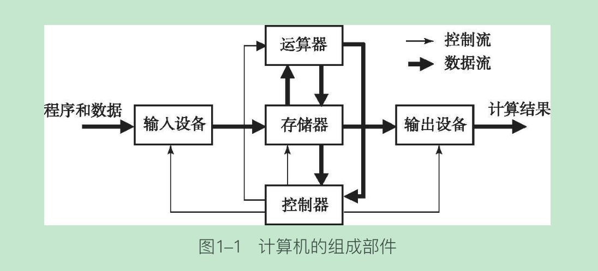

# 一、计算机系统
## （一）计算机组成原理
计算机组成原理主要介绍计算机系统的基本组成，包括基本的硬件系统和软件系统。通过学习CPU、主存储器、I/O接口、系统总线等各个组成部分的基本概念、结构及工作原理和功能实现方法，建立计算机的整机概念，了解其工作原理。

现代计算机自发明以来其结构的基本组成和工作原理一直遵循冯诺依曼机型原理，基本部件有：运算器、控制器、存储器、输入设备、输出设备五部分。
- 运算器：用于进行算术和逻辑运算，也可暂存运算的中间结果
- 控制器：用于控制计算指令和数据的输入、运算和结果处理
- 存储器：用于存放指令和数据
- 输入设备：负责将计算的原始数据输入并转换为机器语言
- 输出设备：负责将计算结果呈现出来

在执行计算操作时，按照存储程序原理，由输入设备输入程序和数据（一系列事先设计好的运算指令和数据以二进制的形式存放在存储器内），将其送入内存后，计算机按一定的方法寻址访问，按照指令中包含操作码和地址码，用指定的操作的方法对数据对象按照规定的规则顺序进行，计算结果由输出设备输出、显示。

计算机组成原理包括运算方法和运算器、多层次的存储体系、指令系统、中央处理器、总线系统、外设与I/O设备、输入输出系统和并行组织和结构。

计算机组成原理的核心思想是“程序存储和程序控制”。

### 1.基本概念
#### （0）计算思维
计算思维是将现实问题转为计算机可解决的问题的思维过程。包括以下几个环节：
- 问题转换方法。指求解实际问题时，利用抽象、数据分析、数据建模、自动化等手段，对问题进行深刻的认识和理解，然后形式化，进行问题转换。
- 计算装置。即计算机系统，熟悉计算装置的工作原理有助于理解计算思维的内涵。
- 处理方法。由于计算机系统不同于其他类型的机器，它所特有的程序存储和程序自动执行功能决定它特有的处理方法。处理方法的核心就是算法，算法对处理的信息进行定义，产生不同的简单操作，再由简单操作构成复杂操作，形成系统的求解问题的方法。

一方面，需要将知识体系分解为知识单元和知识点，以名词概念进行解释。另外，结合层次化、模块化的设计理念和自顶向下系统性理解知识。理解计算机串并结合的思想，计算机系统中有的部件是不相容的，串行的，主动触发部件优先于被触发的部件，有的部件之间是相容的，并行的。学习计算机怎样求解问题，单不要求人类像计算机那样的思考方式，否则容易本末倒置。

##### 层次化、模块化
- by体系结构，可计算模型-->图灵机-->冯诺依曼计算机-->基于总线的微型计算机机构-->多处理器计算机结构
- by组成。中央处理器-->存储器-->输入输出-->总线
- by程序存储和程序控制。数据表示-->运算方法-->指令系统

##### 串并结合思维
若从冯诺依曼计算机结构的本质讲，计算机系统是串行顺序的工作机制，必须逐一执行指令（取指令、分析指令、执行指令）。但为提高计算速度，计算机设计专家提出不少并行技术，如CPU的并行处理技术、存储器的双端口技术。从系统角度看，计算机硬件系统是一个串并结合的复杂系统。并行处理方式的三种特征：
- 时间重叠
- 资源重复
- 资源共享

#### （1）分层体系
- √ 微体系结构层
- √ 指令系统层
- 操作系统层
- √ 汇编语言层
- 面向问题的语言层

#### （2）功能部件组成体系
- CPU
- 存储系统
- I/O系统及其互连

#### （3）计算机
通常所讲的计算机，其全称是电子式数字计算机，它是一种能【存储程序】，能自动连续地对各种【数字化信息】进行【算术、逻辑运算】的快速工具。
- 电子式：指计算机的主要部件由电子电路构成
- 数字计算机：指信息采用数字化表示

##### 运算
首先，计算机是能够运算的设备。运算分为算术运算和逻辑运算。
- 算术运算。算术运算的对象时数值型数据，以四则运算为基础，许多复杂的数学问题可通过相应的算法最终分解为若干四则运算。
- 逻辑运算。逻辑运算用来解决逻辑型问题，如信息检索、判断分析和决策等。

所以我们将计算机的工作泛称为对信息进行运算处理。

##### 数字化信息
计算机中的信息用什么形式来表示呢？简单地讲，是用数字代码来表示各类信息，所以称为数字计算机。

##### 存储程序
计算机是怎样对这些数字化信息进行运算处理呢？它采用的是一种存储程序工作方式，即先编写程序，再由计算机将这些程序存储起来，然后通过连续、快速地执行程序实现各种运算处理。

##### 存储器
为了存储程序和数据，需要存储器

##### 运算器
为了进行运算处理，需要运算器

##### I/O设备
为了输入程序和数据，以及输出运算结果，需要有输入设备和输出设备

##### 控制器
控制器则对计算机的工作进行控制管理

#### （5）存储程序工作方式
计算机的工作最终体现为执行程序。
- 事先编制程序
将求解问题的处理过程用程序来实现，也就是编写程序。程序中包括指令，和需要运算处理的数据或者规定计算机在什么时候从输入设备获取数据。
- 事先存储程序
编写好的程序经由输入设备送入计算机，存放在存储器中。
- 自动、连续地执行程序
由于程序已经事先存储在存储器中，启动计算机并运行程序后，计算机就可以依照一定顺序从存储器中逐条读取指令，按照指令的要求执行操作，直到运行的程序执行完毕。

###### 指令
要求计算机硬件在一步中执行的操作命令称为一条指令，如加法指令。计算机最终执行的程序，其形态就是指令序列，即若干指令的有序集合，每一步将执行一条指令。

###### 控制流
程序执行时按照指令的序列依次读取指令，根据指令所含的空值信息调用数据，进行运算处理。在这一过程中，逐步发出的控制信息称为一种控制信息流，简称控制流，它是驱动计算机工作的因素。

###### 数据流
程序执行时依次处理的数据信息成为一种数据信息流，简称数据流，它是被调用的对象。

#### （6）信息数字化
信息分为两大类：控制信息（指令代码序列）和数据信息。

数据分为两大类：数值型数据和非数值型数据。

- a.在计算机中各种信息用数字代码表示 
例如数字、文字、图像、机器指令、设备状态。

- b.数字代码用数字型电信号来表示 
从物理实现层次看，数字代码需要用电信号去体现，这样才能用电子电路部件实现信息的传送和运算处理。电信号分为：模拟信号和数字信号。模拟信号是用信号的某些参量去模拟信号，如用电信号的幅值模拟数值大小。数字信号是一般只取两种状态的信号。许多物理量如压力和温度，需要先通过传感器变为模拟信号，再转换为数字信号，才可以用计算机处理。

#### （7）计算机系统的软、硬件
。

##### 计算机硬件系统
计算机硬件是指系统中可触摸到的设备实体，如运算器、控制器、存储器、输入设备、输出设备，以及将它们组织为一个计算机系统的总线、接口。

当前运算器和控制器集成在超大规模集成电路上，即芯片上，叫做CPU。负责执行程序，实现运算处理，控制整个系统的部件。

存储器分为高速缓存、主存储器（内存）、外存储器三个层次。

高速缓存集成在CPU内部，作为CPU的一个部分。所以运算器、控制器、高速缓存组成CPU。

CPU与主存储器（内存）合在一起称为主机。

外存储器包括主机之外的磁盘、光盘、磁带。

输入设备的任务是将外部信息输入主机，输出设备则是将主机的运算处理结果或其它信息从主机输出。

##### 计算机软件系统
计算机软件是指系统中的各类程序和文件，由于它们在计算机中体现为一些不能直接触摸到的二进制信息，所以称为软件。

### 2.计算机发展
#### （1）第一代计算机
第一代计算机从第一台计算机`ENIAC`问世到20世纪50年代末。这一时期计算机的主要特征是使用`电子管`作为电子器件，软件还处于初始阶段，使用`机器语言`与符号语言编制程序。主要用于科学计算。

第一代计算机体积大，运算速度低，存储容量不大，程序复杂。

#### （2）第二代计算机
第二代计算机从20世纪50年代末到60年代初。这一时期的计算机的主要特征是使用晶体管作为电子器件，在软件方面开始使用计算机高级语言。不仅用于科学计算，还用于数据处理和事务处理，逐渐用于工业控制。

这一代计算机体积大大减小，质量小、寿命长、耗电少、运算速度快、存储容量比较大。

#### （3）第三代计算机
第三代计算机从20世纪60年代中期到70年代初期。这一时期的计算机的主要特征是使用中小规模集成电路作为电子器件。在这一时期，操作系统的出现使计算机的功能越来越强，应用范围越来越广。不仅用于科学计算，还用于文字处理、企业管理和自动控制等领域，出现了计算机技术与通信技术相结合的管理信息系统，可用于生产管理、交通管理和情报检索等领域。

使用中小规模集成电路制成的计算机，体积与功耗进一步减小，可靠性和运算速度等指标也得到了进一步提高，并且为计算机的小型化、微型化提供了良好的条件。

#### （4）第四代计算机
第四代计算机从1971年到1990年，微型计算机得到了飞速发展。

是指用大规模与超大规模集成电路作为电子器件制成的计算机。这一代计算机各种性能都有了大幅度的提高，应用软件也越来越丰富，应用涉及国民经济的各个领域，已经在办公自动化、数据库管理、图像识别、语音识别和专家系统等众多领域大显身手。

#### （5）第五代计算机
第五代计算机从1990年开始到现在，指用甚大规模集成电路作为电子器件制成的计算机。主要有两个标志，一个是单片集成电路规模达100万晶体管以上，另一个是超标量技术的成熟和广泛应用。

### 3.计算机系统
计算机系统的组成可以分为硬件和软件两大范畴。

#### ➤➤➤ 冯诺依曼机 ➤➤➤
#### （1）冯诺依曼机思想
尽管计算机已经发展了五代，有各种规模和类型，但是当前的计算机仍然遵循冯诺依曼早期提出的基本原理运行。冯诺依曼原理的基本思想奠定了现代计算机的基本架构，并开创了程序设计的时代。

现代计算机都是冯诺依曼结构的计算机，它的基本原理是”存储程序和程序控制“，也就是说，计算机的工作是在程序的控制下运行，而程序又是预先存储在计算机内的。更详细的说就是要利用计算机完成一项处理任务时，首先要把任务转换成程序，然后将程序存储在计算机（内）存储器中，并命令计算机从程序的开始位置（某一条指令）开始工作，计算机的工作路线必须按照程序设计的路线进行，自动地执行并完成任务，直到结束的那条指令执行完为止。

冯诺依曼原理的基本思想是：
- 采用二进制代码表示数据和指令，即信息（数据和指令）的数字化。指令由操作码和地址码组成。
- 采用存储程序工作方式，即事先编制程序，事先存储程序，自动、连续地执行程序。
- 由存储器、运算器、控制器、输入设备、输出设备等5大部件组成计算机硬件系统。
- 原始的冯诺依曼机在结构上以运算器为中心，但演变到现在，电子数字计算机已经转向以存储器为中心。

#### （2）冯诺依曼机原理图

学好计算机的工作原理，即冯诺依曼机的工作原理，对于从根本上理解计算机的组织结构模型和运算过程至关重要。

掌握冯诺依曼机工作原理，不仅仅是了解计算机的5个组成部分加上简单的连接构成的一个原理图，虽然该图非常经典，但是不够形象，仅仅简单掌握了计算机的工作流程，对计算机工作原理掌握较肤浅。专业的学生往往都是在学习了微机原理及汇编语言才能更深刻的掌握计算机的工作原理。非专业的学生可以退而求其次通过冯诺依曼模型机掌握计算机工作原理。

#### （3）冯诺依曼模型机
- 计算机各个组成部分
- 存储程序工作原理

#### （4）信息
计算机的基本功能是对信息进行处理，计算机的整个工作过程可以归结为信息在计算机内的流动。其功能可以归纳为以下几点：
- ① 信息如何表示，以何种形式表示信息（穿孔、磁记录、电信号），数据信息采用何种格式（数制、编码、指令格式或语言等）
- ② 信息如何存储
- ③ 信息的变换，输入设备如何将程序信息变换为计算机能识别的信息形式；输出设备如何将计算机内的结果变换为操作员所能识别的形式
- ④ 信息的传送，外围设备与主机之间、主机内部CPU与存储器之间以及CPU内各寄存器之间信息是如何传送的
- ⑤ 信息的加工处理，一台计算机有哪些运算部件，能完成哪些基本的算术和逻辑运算，是如何完成这些运算的，又如何以这些基本的处理能力为基础，在软件的支持下完成更复杂的加工处理任务
- ⑥ 对上述过程的控制，计算机以什么形式表示它的各种控制命令信息，如何有序的发出这些控制命令以协调各部分的工作。

#### ➤➤➤ 计算机硬件系统 ➤➤➤
#### （1）存储器
#### （2）运算器
#### （3）控制器
#### （4）输入设备
#### （5）输出设备

#### ➤➤➤ 计算机软件系统 ➤➤➤

### 4.信息
#### ➤➤➤ 计算机中信息表示 ➤➤➤
计算机内部所处理的信息必须是数字化信息。因此计算机采用数字化方式来表示各种信息，其内部信息分为两大类：数据和指令。
- 数据信息 
数据信息是计算机所处理的对象，可分为数值型数据和非数值型数据。
	- 数值型数据
	- 非数值型数据：非数值型数据没有确定的值，

- 指令信息 
机器指令信息是计算机产生各种控制命令的基本依据。机器指令规定计算机完成某种操作。计算机处理任何问题，最终都是通过逐条执行机器指令来实现的。一台计算机所有机器指令的集合称为该计算机的指令系统。

#### （1）数制
数制也叫计数制，是用一定符号在统一规则下表示数值的方法，通俗地说就是逢几进位。常使用的数制有二进制、八进制、十进制和十六进制。
- 二进制 
二进制数用2个数字作基础，其中每一个二进制数字不是0就是1。
- 八进制 
一种以8为基数的计数法，采用0、1、2、3、4、5、6、7八个数字，逢8进1。
- 十进制
- 十六进制

#### （2）数位
数的位置。

#### （3）数码
在数制中表示数值大小的不同符号称为数码。例如，八进制有8个数码，即0~7；十进制有10个数码，即0~9。

#### （4）基数
在数制中数码的个数称为基数。例如，八进制的基数为8；十进制的基数为10。将基数记为R。

#### （5）位权
在数制中其中某位上的1所代表的数制大小称为位权。例如，八进制的123,1的位权为64,2的位权为8,3的位权为1；十进制的123,1的位权为100,2的位权为10,3的位权为1。将位权记为 $R^i$。如，10进制的位权表示为（从右到左）$10^0,10^1,10^2,...10^n$

多项式表示数的序列：
$$(N)_R=X_nR_n+X_{n-1}R^{n-1}+...+X_0R^0+X_{-1}R^{-1}+X_{-2}R^{-2}+...+X_{-m}R^{-m}=\sum_{i=-m}^nX_iR^i$$
其中：
- X表示所在数位上的数码
- R表示基数（数码的个数）
- n表示所在数位（通常说的整数第一位是n=0所在的位）

#### （6）二进制
二进制中，它的每个数位能选择的数码只有0或1，数码逢2进位或者借1当2，其基数为2。

##### 用序列表示二进制数
如采用序列的形式表示可将二进制的数表示为：$(X_nX_{n-1}...X_0X_{-1}...X_{-m})_2$
- X为各个数位上的数码
- n表示所在的数位
- 右下角角标表示括号中序列的基数，也就是它是几进制的数
- 位权不需表达出来，因为已经约定在式中了

##### 用多项式表示二进制数
用多项式展开式表示，可以把每个数位的位权表达出来：$(N)_2=X_n\times 2_n+X_{n-1}\times 2^{n-1}+...+X_02^0+X_{-1}\times 2^{-1}+X_{-2}\times 2^{-2}+...+X_{-m}\times 2^{-m}=\sum_{i=-m}^nX_i\times 2^i$
- N表示一个二进制的数
- 角标2表示基数为2
- X 为0或者1
- 整数从$X_0$开始共有n+1位，对应$X_nX_{n-1}...X_0$，从$X_0$开始的位权为$2_0$，一直到$X_n$的位权为$2_n$
- 小数的个数共有 m 个，对应$X_{-1}X_{-2}...X_{-m}$，从$X_{-1}$开始的位权为$2^{-1}$，一直到$X_{-m}$的位权为$2^{-m}$。

##### 例子
$(1001.01)_2=1\times 2^3+0\times 2^2+0\times 2^1+1\times 2^0+0\times 2^{-1}+1\times 2^{-2}=(9.25)_{10}$

#### （7）八进制
八进制中，数码的个数总共有8个，即0~7。数码逢8进位，其基数为8。

用多项式表示八进制数：$(N)_8=X_n\times 8^n+X_{n-1}\times 8^{n-1}+...+X_0\times 8^0+X_{-1}\times 8^{-1}+X_{-2}\times 8^{-2}+...+X_{-m}\times 8^{-m}=\sum_{i=-m}^nX_i\times 8^i（X_i为0至7中的任意数）$
- 上式中基数为8
- 位权为$8^i$

##### 例子
$(106.64)_8=1\times 8^2+0\times 8^1+6\times 8^0+6\times 8^{-1}+4\times 8^{-2}=(70.8125)_{10}$

#### （8）十六进制
在十六进制中，每个数位可用数码的个数有16个，分别是0至9、A至F。对应十进制的0至15。十六进制逢16进位，它的基数是16。

##### 多项式表示十六进制
$(N)_{16}=X_n\times 16^n+X_{n-1}\times 16^{n-1}+...+X_0\times 16^0+X_{-1}\times 16^{-1}+X_{-2}\times 16^{-2}+...+X_{-m}\times 16^{-m}=\sum_{i=-m}^nX_i\times 16^i（X_i为0至F中的任意数）$
##### 例子
$(ABC.DE)_{16}=10\times 16^2+11\times 16^1+12\times 16^0+13\times 16^{-1}+14\times 16^{-2}=(2748.8671875)_{10}$

#### 进制转换
##### 二进制转十进制
通过多项式的转换，可实现二进制与十进制序列的相互转换
##### 八进制转十进制
通过多项式转换
##### 十六进制转十进制
通过多项式转换
##### 二进制与八进制转换
因为3位二进制刚好

### 2.计算机分层体系（层次化思维）
分层体系和功能部件体系是从两个不同的维度描述计算机这一相同的事物。

现代计算机对的分层结构模型，自下而上分为5层：微体系结构层、指令系统层、操作系统层、汇编语言层、面向问题的语言层。每层建立在另一层之上，都是在下一层的基础上增加功能。分层模型简化了系统的复杂性。

#### ➤➤➤ 微体系结构层 ➤➤➤
微体系结构层是具体的硬件层次，可以看做是指令系统层指令的解释器，解释执行【机器指令】序列。

#### ➤➤➤ 指令系统层 ➤➤➤
#### ➤➤➤ 操作系统层 ➤➤➤
#### ➤➤➤ 汇编语言层 ➤➤➤
汇编语言层提供的语言，是将机器语言符号化以便于人们理解。

#### ➤➤➤ 面向问题的语言层 ➤➤➤

### 3.计算机功能部件（模块化思维）
分层体系和功能部件体系是从两个不同的维度描述计算机这一相同的事物。
#### ➤➤➤ 运算器 ➤➤➤
运算器是计算机中进行算术运算和逻辑运算的主要部件。运算器的逻辑结构取决于计算机指令系统、数据表示方法、运算方法和选用电路系统等因素。

运算器的基本操作包括加、减、乘、除四则运算；变更数据的符号；与、或、非等逻辑操作；移位、比较、传送等。

运算器由算术逻辑单元（ALU）、累加器、状态寄存器、通用寄存器组等组成。

#### ➤➤➤ CPU ➤➤➤
CPU即中央处理器，是硬件系统的核心部件，负责读取并执行指令，也就是执行程序。

## （二）计算机体系结构

## （三）操作系统
## （四）计算机网络
## （五）数据库
## （六）分布式

# 二、数据中台
## （一）数据仓库

# 一、Hadoop生态
>Apache Hadoop是一套可靠的、可扩展的、支持分布式计算的开源软件。
- Hadoop是可靠的，它维护多个数据副本，确保能够针对失败的节点重新分布处理。
- Hadoop可扩展，能够处理PB级数据。
- Hadoop是高效的，它以并行的方式工作，通过并行处理加快处理速度。

## （一）HDFS
### 1.HDFS
##### 特点
- 硬件错误，硬件错误是常态而不是异常，错误检测和快速、自动的恢复是HDFS最核心的架构目标。
- 移动计算比移动数据更经济，在靠近数据所存储的位置来进行计算是最理想的状态，消除了网络拥堵。HDFS提供了接口，来让程序自己移动到离数据存储更近的位置。

### 2.HDFS架构
HDFS是一个主从（Master/Slave）体系结构，一个HDFS集群是由一个NameNode和多个DataNode组成。
- 客户端通过同NameNode和DataNode的交互访问文件系统，客户端联系NameNode以获取文件的元数据，而真正的文件IO操作是直接和DataNode进行交互的。
- HDFS暴露了文件系统的名字空间，用户能够以文件的形式在上面存储数据。

#### （1）NameNode
>NameNode管理文件系统的元数据。
- NameNode执行文件系统的名字空间操作，比如打开、关闭、重命名文件或目录。
- 负责确定数据块到具体DataNode节点的映射。
- NameNode可以看作是分布式文件系统中的管理者，讲所有的文件和文件夹的元数据保存在一个文件系统树中。
- NameNode周期性的接受集群中数据节点的心跳和块报告。接收到心跳意味着该数据节点正常工作，块状态报告包含一个该DataNode上所有数据块的列表。

#### （2）DataNode
>DataNode存储实际的数据。
- 一个文件其实被分成一个或多个数据块，这些块存储在DataNode上。
- DataNode负责处理文件系统客户端的读写请求。在NameNode的统一调度下进行数据块的创建、删除和复制。

#### （3）客户端
#### （4）块
- 文件中除了最后一个块，其他块都有相同的大小，默认128M一个数据块。

#### （5）小文件
#### （6）机架
- HDFS运行在跨越大量机架的集群之上，两个不同机架上的节点是通过交换机实现通信的。

#### （7）副本
- HDFS的副本放置策略是将第一个副本放在本地节点，将第二个副本放到本地机架上的另外一个节点，将第三个副本放在不同机架上的节点。
- HDFS会尽量让读取程序读取离它最近的副本（NameNode有所有副本元数据）。

## （二）MapReduce
## （三）YARN
>YARN是一个通用的资源管理平台，可为各类计算框架提供资源的管理和调度。
- YARN可将多种计算框架（MapReduce、storm、Spark）部署到一个公共集群中，共享集群的资源。
- 资源的统一管理和调度：集群中所有节点的资源（内存、CPU、磁盘、网络等）抽象为Container。在资源进行运算任务时，计算框架需要向YARN申请container，YARN按照策略对资源进行调度，进行container的分配。
- 资源隔离：YARN使用了轻量级资源隔离机制进行资源隔离，以避免相互干扰，一旦container使用的资源量超过事先定义的上限值，就将其杀死。
### 1.YARN
#### （1）container
### 2.YARN架构
#### （1）ResourceManager
#### （2）NodeManager

## （四）Hive
## （五）Hbase
## （六）ZooKeeper
## （七）Tez
## （八）Spark
## （九）Sqoop
## （十）Pig
## （十一）Mahout

# 二、数据库
## （一）关系数据库
## （二）mysql
### 1.索引

# 三、网络

# 四、操作系统

# 五、计算机原理与组成

# 六、软件系统

