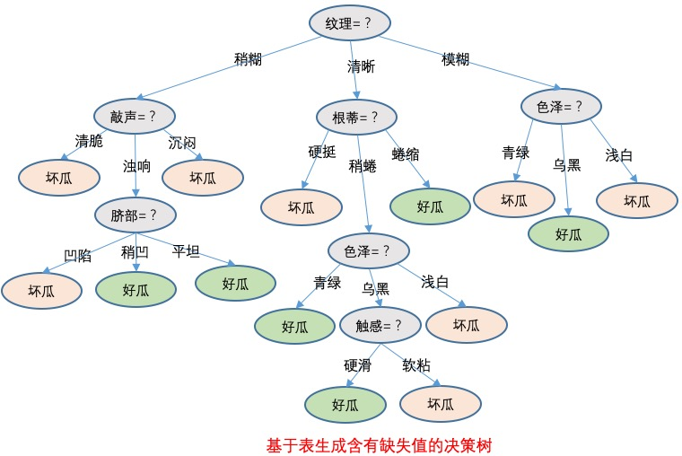

# 一、数学
## （零）数学思维

### 1.抽象思维
- 形象思维是以直观形象和表象为支柱的思维过程。例如，作家塑造一个典型的文学人物形象，画家创作一幅图画，都要在头脑里先构思出这个人物或这幅图画的画面，这种构思的过程是以人或物的形象为素材的，所以叫形象思想象维。
- 动作思维（action thinking）亦称直观动作思维。其基本特点是思维与动作不可分，离开了动作就不能思维。动作思维一般是在人类或个体发展的早期所具有的一种思维形式。
- 根据思维的形态，可以把思维分成动作思维、形象思维和抽象思维（逻辑思维）。其中抽象思维是用词进行判断、推理并得出结论的过程，又叫逻辑思维。抽象思维以词为中介来反映现实，这是思维的最本质特征，也是人的思维和动物心理的根本区别。抽象思维属于理性认识阶段。抽象思维凭借科学的抽象概念对事物的本质和客观世界发展的深远过程进行反映，使人们通过认识活动获得远远超出靠感觉器官直接感知的知识。科学的抽象是在概念中反映自然界或社会物质过程的内在本质的思想，它是在对事物的本质属性进行分析、综合、比较的基础上，抽取出事物的本质属性，撇开其非本质属性，使认识从感性的具体进入抽象的规定，形成概念。空洞的、臆造的、不可捉摸的抽象是不科学的抽象。科学的、合乎逻辑的抽象思维是在社会实践的基础上形成的。
- 并运用概念进行推理、判断的思维活动。
- 抽象思维与形象思维不同，它不是以人们感觉到或想象到的事物为起点，而是以概念为起点去进行思维，进而再由抽象概念上升到具体概念。
- 只有穿透到事物的背后，暂时撇开偶然的、具体的、繁杂的、零散的事物的表象，在感觉所看不到的地方去抽取事物的本质和共性，形成概念，才具备了进一步推理、判断的条件。
- 抽象思维不能走向极端，而必须与具体思维相结合，由抽象上升到具体。
- 不管你过去是多么地近乎本能的习惯于形象思维和抽象思维相互干扰的混合状态，你在一些相对重要得问题上必须强迫自己进行一个完整的抽象思维过程。
- 与抽象思维的定义密切相关的是分析、综合、归纳、演绎的定义。
- 分析是指用思维把事物分解为各个部分分别加以考察从而便于形成各个概念或便于确定概念间的关系的方法。归纳是指思维找出多个特殊性的具体事物的共同性的方法。综合是指思维把事物的各个部分用形成的各个概念分别代表，形成原来的整体事物的概念或确定这些各个部分的概念的关系的思维过程。演绎是指思维从事物的一般性返回到事物的具体的个别性的方法。
- 演绎推理（Deductive Reasoning）是由一般到特殊的推理方法。与“归纳法”相对。推论前提与结论之间的联系是必然的，是一种确实性推理。
- 演绎推理的形式有三段论、假言推理和选言推理等。
- 所谓演绎推理，就是从一般性的前提出发，通过推导即“演绎”，得出具体陈述或个别结论的过程。
- 抽象涉及到的第一个含义就是概念上的复杂度

## （一）微积分
### 0.历史渊源
#### （1）极限思想
- 数学分析（又称高级微积分，数学基础分支，一般指以微积分学和无穷级数一般理论为主要内容）就是用极限思想来研究函数的一门学科。数学分析中的一系列重要概念，如函数的连续性、导数以及定积分等等都是借助于极限来定义的。
- 起初牛顿和莱布尼茨以无穷小概念为基础建立微积分，之后才以极限概念作为基础。

#### （2）无穷小悖论
- 也叫“贝克莱悖论”，笼统地说，贝克莱悖论可以表述为“无穷小量究竟是否为0”的问题，就无穷小量在当时实际应用而言，它必须是0，又不是0。但从形式逻辑而言，这无疑是一个矛盾。
- 起初，微积分主要建立在无穷小分析之上，而无穷小后来证明是包含逻辑矛盾的。
- 贝克莱指责牛顿，为计算比如说 $x^2$ 的导数，先将 $x^2$ 取一个不为0的增量 $\Delta x$，由 $\Delta y=(x+\Delta x)^2-x^2=2x\Delta x+\Delta x^2$，$\frac{\Delta y}{\Delta x}$ 得到$2x+\Delta x$，最后突然令 $\Delta x=0$，求得导数为 $2x$。这是“依靠双重错误得到了不科学却正确的结果”。因为无穷小量在牛顿的理论中一会说是零，一会又说不是零。因此，贝克莱嘲笑无穷小量是“已死量的幽灵”。
- 无穷小量悖论的解决：本质上说，无穷小量悖论没有解决。用极限的定义与公式巧妙的绕过了悖论，导数并非两个无穷小量之比，而是这两个无穷小量之比的极限。无穷小量不是等于0，二是趋近于0。
- 解决：无穷小量不是0。差商 => 差商的极限
### 1.函数
#### （1）函数
##### 定义
##### 特点
- 函数显示输入与输出的关系，函数有三个重要部分：输入、关系、输出。
- 有多种形式描述函数，比如 $f(x)$、乘以2、$x^2$
- $f(x) = x^2$，$x$ 表示输入，$f$ 是函数的名字，$x^2$ 是输出。关系是平方，$f$ 是这个关系。
- 函数有时没有名字，例如 $y = x^2$，$x$ 是输入，平方是关系，$y$ 是输出。
- 函数可以输入一个集合的元素来输出另一个集合的元素。
- 函数的规则：要使用于所有可能的输入；每一个输入值只有一个关系，输出唯一。
- 函数是关系，关系不全是函数，假如一个输入对应多个输出，就是关系不是函数。
- 函数是两个数集间的一种特殊对应，是两个变量间的变化规律，函数的导数和定积分是函数知识的提升，它们都是特殊类型的极限，极限是研究变量在无限变化中的变化趋势，本质是静止中认识运动，有限中认识无限，量变中认识质变。导数与定积分是互逆运算。

##### 举例
#### （2）初等函数
#### （3）复合函数
#### （4）反函数
### 2.极限
#### （1）极限
##### 定义
##### 特点
- 接近于0却永远不等于0的极限状态
- 极限思想是反映一个变量与另一个已知量的一种无限逼近，然后用这个已知量代表变量的终极值。
- 极限思想成为最伟大的数学工具
- 极限反映的是无限变化过程中的终极限度

#### （2）数列极限
#### （3）函数极限
##### 定义
##### 特点
- 函数极限表现为自变量在变化过程总函数值的变化趋势
##### 举例
### 3.连续
### 4.导数
#### （1）变化量
##### 定义
##### 特点
- $\Delta$是改变量，一般不为0，所以可以写 $\Delta x \to 0$ 这样的表达式。
- 改变量就是新的值减去旧的值，自变量的改变量是 $\Delta = x_2-x_1$，因变量的改变量是 $\Delta y = y_2-y_1$，也可以是$\Delta y = f(x_2)-f(x_1)$

##### 举例

#### （2）平均变化率
##### 定义
平均变化率，是y的增量与x的增量的比，可以用来观察函数的变化速度以及函数是怎样变的。
一个函数在$x_0$处有增量$\Delta x$，则$y$也会有相应的增量$\Delta y$，那么我们就称$\Delta y$与$\Delta x$的比$\frac{\Delta y}{\Delta x}$为函数$f(x)$在$x_0$处增量为$\Delta x$的平均变化率。
##### 特点
- 我们可以利用平均变化率的知识，求出一个股票在某一时间段内的平均变化率，从而了解股票的趋势以及未来的走势。
- 导数其实就是平均变化率在增量趋于 0 时的极限。导数可以理解为当 $\Delta x \to 0$ 时，平均变化率的极限，也就是$\lim\limits_{\Delta x \to 0}\frac{\Delta y}{\Delta x}$

##### 举例
1.一般地，函数 $f(x)$ 在区间 $[x_1,x_2]$ 上的平均变化率 $\frac{f(x_2)-f(x_1)}{x_2-x_1}$。平均变化率是曲线陡峭程度的“量化”，曲线陡峭程度是平均变化率的“可视化”。

#### （3）瞬时变化率（导数）
##### 定义
如果当 $\Delta x \to 0$ 时，$\frac{\Delta y}{\Delta x}$有极限，我们就说函数 $y=f(x)$ 在点 $x_0$ 处可导，这个极限叫做 $f(x)$ 在点 $x_0$ 处的导数（即瞬时变化率，简称变化率）。
##### 特点
- 可以通过减小自变量的改变量，用平均变化率“逼近”瞬时变化率。
- 可以用 $f(x_0+\Delta x)-f(x_0)$ 除以 $\Delta x$ 来计算瞬时变化率。
- 平均变化率是曲线上两点割线的斜率，瞬时变化率是曲线上一点切线的斜率。

##### 举例

#### （4）导数
##### 定义
##### 特点
- 导数，也叫导函数值，又名微商。
- 一个函数在某一点的导数描述了这个函数在这一点附近的变化率。
- 导数全是关于改变的，导数表达在任何一点的改变速度（变化率）。
- 导数可以用莱布尼茨记法表示：$\frac{dy}{dx}$
- 两点平均变化率：$\frac{\Delta y}{\Delta x}$。一点处瞬时变化率：让$\Delta \to 0$，但不是0，趋近0称为 $dx$，即无穷小。同样，$\Delta y$ 变成无穷小，称为 $dy$。结果就是 $\frac{dy}{dx}$
- 两点的平均变化率可以用$\frac{\Delta y}{\Delta x}$ 表示，但是一点处的变化率怎么表示，可以让$\Delta \to 0$，即$dx$。
- 无穷小思维和极限思维求导数
- “xxx的导数”可以写成 $\frac{d}{dx}$，例如 $x^2$ 的导数写成 $\frac{d}{dx}x^2$。
- $f'(x)$ 也是导数的另一个写法，例如 $f'(x) = 2x$ 表示 $f(x)$ 的导数等于 $2x$。
- 导数可以写成 $\frac{dy}{dx}$
- 函数 $y=f(x)$ 在 $x_0$ 处可导，则它在 $x_0$ 处连续，反之不然。
- 导数是差商的极限，$f'(x_0)=\lim\limits_{x \to x_0} \frac{f(x)-f(x_0)}{x-x_0}$

##### 举例
### 5.微分
### 6.一元微分学
#### （1）数列的极限
#### （2）函数的极限
#### （3）函数的导数
#### （4）闭区间上连续函数的性质
#### （5）无限小增量公式
#### （6）有限增量公式
#### （7）函数局部行为研究
#### （8）函数全局行为研究
### 7.一元积分学
## （二）概率论

## （三）统计学

## （四）线性代数

# ————————————————————

# 二、机器学习
## （一）机器学习基础
### 1.什么是机器学习
- 机器学习就是让机器具备找一个函数的能力。找到一个函数以后，就能处理输入产生输出。语音识别：$f(声音)=“how are you”$。图像识别：$f(图片)=“cat”$。不同的函数类型：回归Regression，输入数字，输出是一个数值。分类Classification，输入类别，输出类别。生成Strucured Learning，生成图片，文档。如何寻找函数。首先依据领域知识假设一个f。

### 2.机器学习基础概念
#### （0）机器学习分类
##### 按预测属性类型
- 分类任务
- 回归任务

##### 按学习方式
- 监督学习 
- 无监督学习
- 半监督学习
- 强化学习

#### （1）特征
##### 定义
我们可以用下标表示属性，例如用 $x_{i1},...,x_{id}$ 表示某一个样本的属性 1,...,d
#### （2）标签
在已知的数据集中，目标列称为标签label。它可以在模型学习过程中进行指导。
#### （2）样本
##### 定义
我们用 $(x_i,y_i)$ 表示数据集的一个样本。
#### （3）数据集
##### 定义
我们用大写字母 $D$ 表示数据集，数据集是一个集合，$D = \{(x_1,y_1),(x_2,y_2),...,(x_m,y_m)\}$
数据集分为：
- 训练集 
训练集用于训练和确定模型参数。
- 验证集 
验证集用于模型选择，帮助选出最好的模型。
- 测试集 
测试集用于评估模型，测试模型用于新样本的能力（即泛化能力）。

#### （4）函数
#### （5）模型
模型（model），带有未知参数（unknown parameter）的函数（function），一组函数，函数集合。
#### （6）收敛
- 收敛是一个数学名词，是研究函数的一个重要工具，是指汇聚于一点，向某一值靠近。收敛类型有收敛数列、函数收敛、全局收敛、局部收敛。
- 在数学分析中，与收敛相对的概念就是发散。收敛与发散判断方法简单来说就是有极限（极限不为无穷）就是收敛，没有极限就是发散。简单来说就是看极限是否存在。
- 一个迭代算法（迭代是循环的一次执行），随着迭代的进行，输出越来越接近一些特定值就是收敛。
- 机器学习模型不收敛的直观体现是loss函数无法下降。不论是loss值一直大幅震荡还是loss值一直居高不下，都表示模型不收敛。
3.领域知识
4.参数
weight，bias
5.loss损失函数
损失函数 $L(b,w)$ 是关于参数的函数。输入是模型model里的参数，输出是
6.估测值 $y$
7.真实值 $\hat y$

### 3.评价指标

## （二）数据处理
## （三）机器学习模型
### 0.线性模型
#### （1）
### 1.树模型
#### （1）节点

- 作为一种常见的解决分类问题的模型，决策树的形状类似于一个树，包含根节点、中间节点和叶子节点。
- 每个叶子节点存放一个类别，每个非叶子节点标识一个特征属性上的测试。根节点代表总体样本，中间节点表示一个属性上测试得到的样本子集，叶子节点存放标签。
- 决策树决策过程就是从根节点开始，测试待分类项中相应的属性，并按照其值选择输出分支，直至到达叶子节点，将叶子节点存放的类别作为决策结果。
- 根节点、中间节点、叶子节点、决策节点、子节点。

#### （2）选择分裂属性
决策树分类属性的选择就是选择哪个自变量作为树杈，即在 n 个自变量中，优先选择哪个自变量进行分叉，而采用何种计算方式选择树杈决定了决策树算法的类型。
典型的分裂属性的选择方法有ID3算法、C4.5算法、CART算法三种。三种决策树算法选择树杈的方式是不一样的。
#### （3）熵
熵是衡量数据集纯度的指标。
$$E(D) = -\sum_{i=1}^mp_i\log_2p_i$$
- D 表示（分裂前的）数据集。E(D) 就是数据集的熵。
- m 表示目标属性有 m 个值，$i=1,2,...,m$，$m$为类别数。
- $p_i=\frac{|C_i|}{n}$，$|C_i|$ 指类别为 $C_i$ 的样本数，n 表示样本大小，$p_i$ 表示类别 $C_i$ 的样本占比。

例如：
如果有一个大小为10的布尔值样本集$S_b$，其中有6个真值，4个假值。那么该样本的熵为：
$$Entropy(S)=-\frac{6}{10}\log_2\frac{6}{10}-\frac{4}{10}\log_2\frac{4}{10}=0.9710$$
样本集的熵越高，则样本集的纯度越低。样本集的纯度越高，样本集的熵越低。以上例子，样本集的熵为0.9710，已经很高了，说明样本集的纯度很低，再看样本集，一共10个样本，6个真值，4个假值，纯度缺失很低。如果有5个真值，5个假值，样本集的熵为1。如果有10个真值，0个假值，样本集的熵为0。
#### （4）信息增益
信息增益是分支属性对于数据集分类好坏程度的度量。

信息增益 = 分裂前后数据集熵降低的值 = 分裂前数据集的熵 - 分裂后数据集的熵
$$gain_A(D)=E(D) - E_A(D)$$
- E(D) 分裂前数据集的熵
- $E_A(D)$ 属性 A 对数据集 D 划分（分裂）后的熵（子集熵的和）
- $gain_A(D)$ 是属性 A 分裂数据集 D 后的信息增益
$$E_A(D)=\sum_{j=1}^v{\frac{|D_j|}{|D|}E(D_j)}$$
- $E_A(D)$ 表示分裂后数据集的熵（数据子集的熵的和）
- j=1,2,...,v 表示分裂后的分支个数
- $|D_1|,|D_2|,...,|D_v|$ 表示分裂后的各个分支的数据子集的样本数。$|D|$ 是分裂前数据集的样本数。
- $E(D_1),E(D_2),...,E(D_v)$ 表示分裂受各个分支的数据子集的熵。

#### （5）ID3算法
- 哪个属性分裂数据集的信息增益最大，ID3就选择哪个属性分裂数据集
- ID3算法的不足之处是只能选择离散型属性进行分裂，即仅支持分裂的属性是离散值，信息增益的选择分裂属性的方式会偏向选择具有大量值的属性
- ID3算法是目前决策树算法中较有影响力的算法，1986年提出，该算法只是一个启发式的算法。
- ID3算法的核心是判断测试哪个属性为最佳的分类属性。ID3算法选择分裂后信息增益最大的属性进行分裂，以信息增益度量属性选择。
- ID3算法是在每个节点处选取能获得最高信息增益的分支属性进行分裂
- 在每个决策节点划分分支，选取分支属性的目的是将整个决策树的样本纯度提升
- 衡量样本集纯度的指标是熵，计算分支属性对于样本集好坏程度的度量是信息增益
- 由于分裂后样本集的纯度提高，样本集的熵降低，熵降低的值就是该分裂方法的信息增益
- 以某个属性作为分支属性时能获得最大的信息增益，则认为该属性具有最强的区分样本的能力

#### （6）信息增益率
$$gain\_ratio_A(D) = \frac{gain_A(D)}{split_A(D)}$$
- $gain\_ratio_A(D)$ 表示属性 A 分裂数据集 D 的信息增益率
- $gain_A(D)$ 表示属性 A 分裂数据集 D 的信息增益
- $split_A(D)$表示属性 A 分裂数据集 D 的分裂信息

#### （7）分裂信息
$$split_A(D) = -\sum_{j=1}^v\frac{|D_j|}{|D|}\log_2\frac{|D_j|}{|D|}$$
- $split_A(D)$表示属性 A 分裂数据集 D 的分裂信息
- $j=1,j=2,...,j=v$ 表示分裂后的分支数目
- $|D_1|,|D_2|,...,|D_v|$表示分裂后各个分支，即数据子集的样本数
- $|D|$ 是分裂前的数据集的样本数

#### （8）C4.5算法
- C4.5算法采用最大信息增益率的属性被选为分裂属性
- C4.5支持离散型和连续性属性，即分裂的属性可以是离散型也可以是连续性。
- 对于分裂属性为连续型时，只需将连续型变量由小到大递增排序，取中点作为分裂点，然后按照离散型变量计算信息增益的方法计算信息增益
- C4.5只是ID3算法的改进算法

#### （9）基尼系数
$$Gini(D)=1-\sum_{i=1}^mp_i^2$$
- Gini(D) 表示数据集 D 的基尼系数
- i=1,i=2,...,i=m 表示目标属性有 m 个分类
- $p_i=\frac{|C_i|}{|D|}$。$|C_1|,|C_2|,...,|C_m|$表示目标属性各个类别的样本数，$|D|$ 是总样本数。

基尼值越小，数据集的纯度越高。
属性 A 分裂数据集的基尼系数定义为：
$$Gini_A(D) = \sum_{j=1}^v\frac{|D_j|}{|D|}Gini(D_j)$$
- $Gini_A(D)$ 表示属性 A 划分数据集得到的基尼系数和
- j=1,j=2,...,j=v 表示分支个数，$|D_1|,|D_2|,...,|D_v|$表示各个分支数据子集的样本数，|D| 是分裂前样本数。
- $Gini(D_1),Gini(D_2),...,Gini(D_v)$表示各个分支数据子集的基尼系数 

#### （10）CART算法
- CART算法在候选属性集合A中选择那个使得划分后基尼系数最小的属性作为最优划分属性。
- CART是个二叉树，也就是当使用某个特征划分样本集合只有两个集合：等于给定的特征值的样本集合D1和不等于给定的特征值的样本集合D2。
CART全称是分类与回归树，通过构建二叉树达到预测目的，是一种十分有效的非参数分类和回归算法。

#### （3）树剪枝

### 2.集成学习
#### （1）集成学习
集成学习就是将若干个弱分类
#### （2）弱学习器
#### （3）强学习器
#### （4）bagging
#### （5）boosting
- 样本选择：bagging算法是有放回的随机采样。boosting算法是每一轮训练集不变，只是训练集众的每个样例在分类器中的权重发生变化，
#### （6）stack

## （四）XGBoost
- XGBoost（Extreme Gradient Boosting，极限梯度提升）用来取代回归模型（线性回归、逻辑回归）。
- XGBoost基于决策树的集成机器学习算法，以梯度提升（Gradient Boost）为框架。
- 在非结构化数据（图像、语音、文本）的预测问题中，神经网络表现优于其他算法或框架，但在处理中小型结构数据时，基于决策树的算法是最好的。
- 决策树演变：Decision Trees-->Bagging-->Random Forest-->Boosting-->Gradient Boosting-->XGBoost
- XGBoost特点：应用范围广泛，可以解决回归、分类、排序以及用户自定义的预测问题；可移植性，可以在windows、Linux、OS X上运行；语言，支持C++、python、R、Java、scala等机会所有主流编程语言；云集成，支持AWS、Yarn集群，可以很好的配合Flink、Spark等其他生态系统。

##### 决策树及其演变类比生活实例（面试场景）
- 决策树：每一名面试官都有一套自己的面试标准，比如教育水平、工作经验以及面试表现等。决策树类似于面试官根据他自己的标准面试求职者。
- 袋装法（Bagging）：现在面试官不止一人，而是一整个面试小组，小组中的每位面试官都有投票权。Bagging（Boostrap Aggregating）就是通过民主投票过程，综合所有面试官的投票，然后做出最终决定。
- 随机森林（Random Forest）：这是基于Bagging的算法，但与Bagging有明显的区别，它随机选择特征子集。也就是，每位面试官只会随机选择一些侧面来对求职者进行面试（比如测试编程技能的技术面或者是评估非技术技能的行为面试）
- Boosting：这是一种替代方法，每位面试官根据前一位面试官的反馈来调整评估标准。通过部署更动态的评估流程来提升面试效率。
- 梯度提升（Gradient Boosting）：这是Boosting的特例，这种算法通过梯度下降来最小化误差。用面试类比的话，就是战略公司用案例面试来剔除那些不符合要求的求职者。
- XGBoost：极限梯度提升。他可以在最短时间内用更少的计算资源得到更好的结果。

### 1.概念
#### （1）集成学习
- 集成学习的基本思想是把多个学习器通过一定方法进行组合，以达到最终效果的提升。

#### （2）弱学习算法
- 识别准确率仅比随机猜测高一些的学习算法为弱学习算法。
- 我们只需先找到一个弱学习算法，再将其提升为强学习算法，而不用一开始就找强学习算法。

#### （3）强学习算法
- 识别准确率很高并能在多项式时间内完成的学习算法称为强学习算法。

#### （4）Boosting
Boosting会训练一系列的弱学习器，并将所有学习器的预测结果组合起来作为最终预测结果，在学习过程中，后期的学习器更关注先前学习器学习中的错误。
- AdaBoosting 
1995年提出AdaBoost，继承了Boosting的思想，为每个弱学习器赋予不同的权重，将所有弱学习器的权重和作为预测的结果，达到强学习器的效果。
- Gradient Boosting 
1999年提出，与AdaBoost不同的是，它将损失函数梯度下降的方向作为优化的目标，新的学习器建立在之前学习器损失函数梯度下降的方向。代表算法有GBDT、XGBoost。

#### （5）Bagging
#### （6）Stacking

# 三、深度学习

# ————————————————————
# 四、数据分析
# 五、数据挖掘
## （一）数据挖掘介绍
## （二）认识数据
数据挖掘的第一步就是认识数据，了解数据。
### 1.数据类型
- 用来描述数据对象的属性可以具有不同的类型，定量或者定性的。
- 数据的类型决定我们应使用何种工具和技术来分析数据。

#### （1）数据集
>数据集可以看做数据对象的集合。
- 通常，数据集是一个文件，其中对象是文件的记录（或行），而每个字段（或列）对应于一个属性。
- 基于记录的数据集在关系数据库系统中是最常见的。

##### 数据集特性
- 维度：数据集的维度是数据集中对象具有的属性数目。低维数据与中、高维数据有质的区别。分析高维数据往往陷入维度灾难。数据预处理有时减少维度或称为维规约就是为了避免陷入维度灾难。
- 稀疏性：有些数据集，如具有非对称特征的数据集，一个对象的大部分属性上的值都为0，在许多情况下，非零项还不到1%。稀疏性有时是一个优点，可节省计算时间和存储空间。有些数据挖掘算法仅适合处理稀疏数据。
- 分辨率：

##### 数据集类型
我们分析三种数据集类型：记录数据、基于图形的数据、有序数据。
- 记录数据：
- 基于图形的数据：
- 有序数据：对于某些数据类型，属性具有涉及时间或空间序的联系。
    - 时序数据：时序数据也称时间数据，每个记录包含一个与之相关联的时间。时间序列数据是一种特殊的时序数据，其中每个记录都是一个时间序列，即一段时间以来的测量序列。例如：金融数据集可能包含各种股票每日价格的事件序列对象。
    - 序列数据：序列数据是一个数据集合，它是各个实体的序列，如词或字母的序列。除没有时间戳之外，它与时序数据非常相似，只是有序序列考虑项的位置。空间数据除了其他类型的属性之外，还具有空间属性，如位置或区域。

#### （2）数据对象
> 数据对象有时也叫作记录、点、向量、模式、事件、案例、样本、观测或实体。数据对象用一组刻画对象基本特性的属性描述。

#### （3）属性
>属性有时也叫作变量、特性、字段、特征或维。属性是对象的性质或特性，它因对象而异，或随时间而变化。
- 例如：眼球颜色因人而异，物体的温度随时间而变。

##### 属性的类型
- 定性的（分类的）
    - 标称属性：代表某种类别、编码或者状态，标称属性值不具有有意义的序且不是定量的。例如，邮政编码、性别等。可做=、≠操作。度量操作有众数、熵、卡方检验$\chi ^2$。均值和中位数无意义。二元属性是标称属性的一种。
    - 序数属性：值之间具有有意义的序。例如矿石硬度等。可做<、>操作。度量操作有众数、中位数、中值、百分位，均值意义不大。
- 定量的（数值的）
    - 区间属性：可以计算出不同值之间的差值，但是不能简单描述一个值和另一个值的倍数问题，也就是说不能用比率来谈论这些值。例如温度、日期等。可做+、-操作，度量操作有均值、标准差、皮尔逊相关、t 和 F 检验。
    - 比率属性：可以描述一个值和另一个值的倍数关系。例如：年龄、质量、长度等。可做*、\操作。度量操作有几何平均、调和平均等。
- 注意操作符是累积的，比率属性可做=、≠、>、<、+、-、*、\等。
- 零散属性具有有限个值或无限可数个值。连续属性是取实数值（浮点数）的属性。通常，标称和序数属性是李兰的，而区间和比率属性是连续的，但不是绝对的。

### 2.数据质量
数据挖掘使用的数据常常在收集时未明确其目的，不能在源头控制其质量。相比之下，统计学的实验设计或调查往往其数据质量都达到了一定要求。由于无法避免数据质量问题，因此第一步往往需要进行数据清洗。
导致数据质量的原因：
- 测量误差：测量误差是指测量过程中导致的问题，如记录的值与实际值不同。
- 数据收集误差：指诸如遗漏数据对象或属性值，或不当地包含了其他数据对象等错误。
- 测量误差或数据收集误差可能是系统的也可能是随机的。

常见的数据质量问题：
#### （1）噪声<非法无效>
噪声是测量误差，数值可能被扭曲。噪声通常用于包含时间或空间分量的数据。完全消除噪声通常是困难的，许多数据挖掘工作都关注鲁棒算法，即在噪声干扰下也能产生可接受的结果。
#### （2）伪像
数据错误可能是更确定性现象的结果，如一组照片在同一地方出现条纹，数据的这种确定性失真称作伪像。
#### （3）离群点（异常值）<合法有效>
离群点，也称为异常对象、异常值，是在某种意义上具有不同于数据集中其他大部分数据对象的特征的数据对象，或是相对于该属性的典型值来说不寻常的属性值。
- 与噪声不同的是，离群点可以是合法的数据对象或值。因此，不像噪声，离群点本身有时是人们感兴趣的对象。
- 例如，欺诈和网络攻击检测中，目标就是从大量正常对象或事件中发现不正常的对象和事件。

#### （4）遗漏值
一个对象遗漏一个或多个属性值的情况并不少见，有时可能会出现信息收集不全的情况，例如有的人拒绝透露年龄或体重。或者有些情况下某些属性并不能用于所有对象。

处理遗漏值的策略，每种策略可能适用于特定的情况：
- 删除数据对象或属性 
如果某个数据值只有少量的对象具有遗漏值，则忽略他们是划算的。但是，可能被删除的属性对分析是至关重要的，此时删除要非常小心。
- 估计遗漏值（平滑、插值） 
有时，遗漏值可以可靠的估计。
    - 插值，如果属性是连续的，则可以使用最近邻的平均属性值。如果属性是分类的，则可以取最近邻中最常出现的属性值。
-在分析时忽略遗漏值 
许多算法可以修改、忽略遗漏值。但是，如果整个属性数据很少，或者遗漏值的数量很大，则不能忽略遗漏值。

#### （5）数据不一致
例如，身高是负数，地址填的是邮编。需要检测这种不一致的数据，如果可能的话，纠正错误。

#### （6）数据重复
数据集可能包括重复或几乎重复的数据对象。
- 如果重复数据代表相同的对象，需要删除。
- 如果重复数据代表不同的对象，需要添加额外属性避免重复。

#### （7）时效性
有些数据收集后就开始老化，如果数据已过时，则基于它的模型和模式也已经过时。

#### （8）抽样偏倚
抽样偏倚指样本包含的不同类型的对象与它们在总体中的出现情况不成比例。抽样偏倚通常导致不正确的分析。

#### （9）相关性
可用的数据必须包含应用所需要的信息。考虑构造一个模型，预测交通事故发生率，如果忽略了驾驶员的年龄和性别信息，那么除非这些信息可以间接地通过其他属性得到，否则模型的精度可能是有限的。
- 如果若干属性是强相关的，则说明这些属性可能提供了冗余的信息，可以决定只保留一个（如销售税和销售价格）。

### 3.数据的基本统计描述
把握数据的全貌可以更全面的认识数据，基本统计描述可以用来识别数据的性质，凸显哪些数据值应该视为噪声或离群点。
#### （1）中心趋势度量：均值、中位数、众数
中心趋势度量数据分布的中心位置。直观的说，给定一个属性，它的值大部分落在何处？
中心趋势度量包括均值、中位数、众数和中列数。
- 在具有完全对称的数据分布的单峰频率曲线中，均值、中位数、众数都是相同的中心值。
- 在大部分实际应用中，数据都是不对称的。它们可能是正倾斜的，众数出现在小于中位数的值上。负倾斜的话，众数出现在大于中位数的值上。
##### 均值
定义：令$x_1,x_2,...,x_n$为某属性 $X$ 的 $N$ 个观测值，该值集合的均值为$\bar x=\frac{\sum_{i=1}^Nx_i}{N}=\frac{x_1+x_2+...+x_N}{N}$。

特点：
- 数据集“中心”最常用的度量是（算术）均值。

##### 加权算术均值或加权平均
有时，对于 $i=1,...,N$ 的每个值 $x_i$ 可以与一个权重 $w_i$ 相关联。权重反映它们所依附的对应值的意义、重要性或出现的频率。$\bar x=\frac{\sum_{i=1}^Nw_ix_i}{\sum_{i=1}^Nw_i}=\frac{w_1x_1+...+w_Nx_N}{w_1+...+w_N}$。
特点：
- 尽管均值是描述数据集的最有用的单个量，但是它并非总是度量数据的最佳方案。主要问题是均值对极端值（如离群值）很敏感，容易“被平均”。

##### 截尾均值
特点：
- 为了抵消少数极端值的影响，我们可以使用截尾均值。截尾均值是丢弃高低极端值后的均值。

##### 中位数
特点：
- 对于倾斜（非对称）数据，数据中心的更好度量是中位数。中位数是有序数据值的中间值。如果 N 是奇数，中位数是有序集的中间值。如果 N 是偶数，如果 $X$ 是数值，中位数取中间两个值的平均值。如果 $X$ 非数值，中位数取中间两个值之间的任意值。
- 当观测的数量很大时，中位数的计算开销很大。

##### 众数
特点：
- 数据集的众数是集合中出现最频繁的值。
- 可能最高频率对应多个不同值，导致多个众数。具有一个、两个、三个众数的数据集合分别称为单峰、双峰、三峰。
- 极端情况下，如果每个数据值仅出现一次，则它没有众数。

##### 中列数
- 中列数是数据集的最大值和最小值的平均值。

#### （2）数据散布度量：极差、四分位数、方差、标准差、四分位数极差
#### （3）图形显示

### 3.数据预处理
### 4.数据度量
## （三）数据探查
## （四）分类
## （五）关联分析
## （六）聚类
## （七）异常检测
# ————————————————————
# 六、运营分析